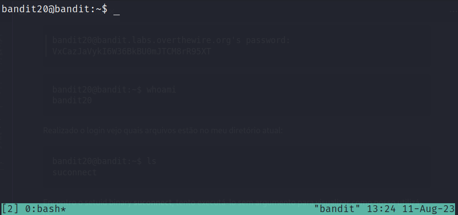
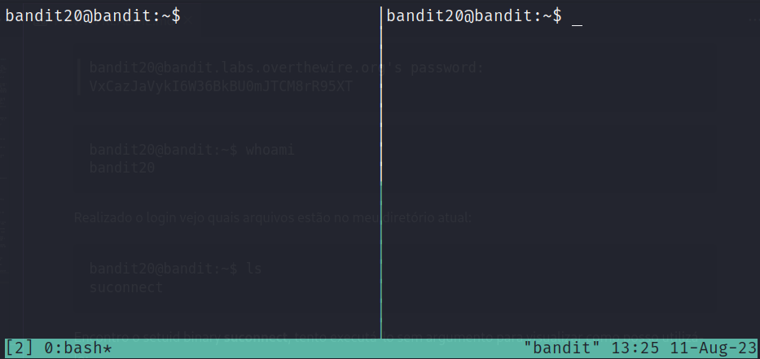
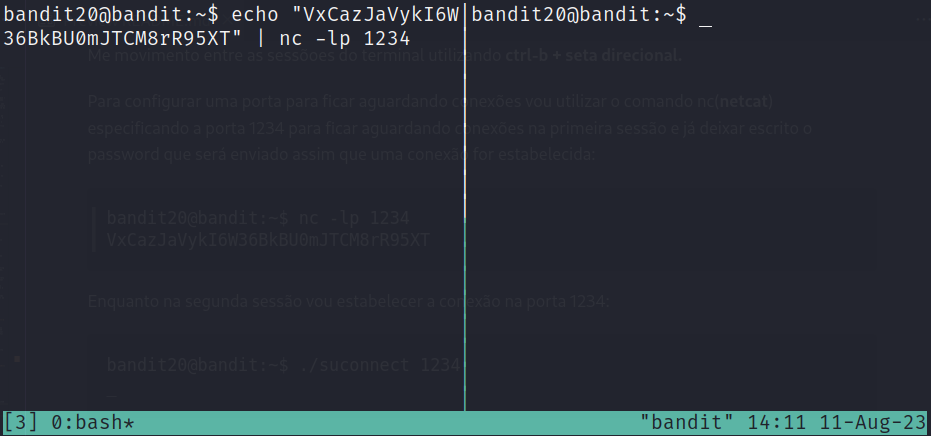
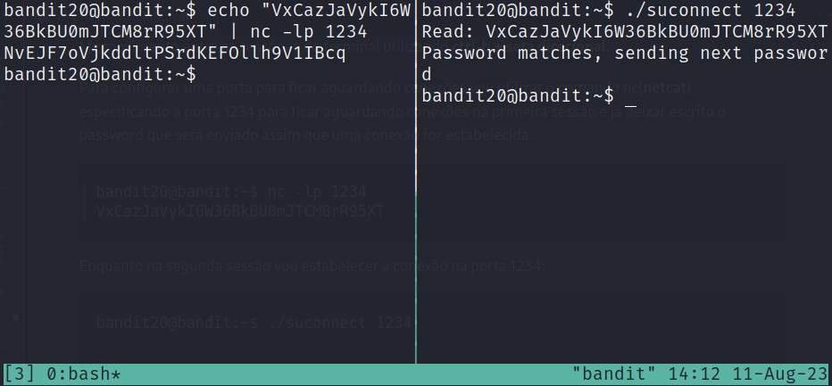

# [Bandit Level 20-21](https://overthewire.org/wargames/bandit/bandit21.html)

## Descrição original
There is a setuid binary in the homedirectory that does the following: it makes a connection to localhost on the port you specify as a commandline argument. It then reads a line of text from the connection and compares it to the password in the previous level (bandit20). If the password is correct, it will transmit the password for the next level (bandit21).

NOTE: Try connecting to your own network daemon to see if it works as you think

## Introdução
O objetivo desse level é utilizar o arquivo **suconnect** que é um setuid binary localizado no diretório home, o qual faz uma conexão com o servidor localhost(servidor atual) na porta especificada. Após realizar a conexão é feita a leitura de uma linha da conexão e uma comparação de se ela é igual ao password do level **bandit20**, caso seja será transmitido o password do level **bandit21.**


    Um setuid binary é um tipo especial de arquivo binário em sistemas linux que possui a permissão "setuid" ativada. O termo "setuid" é uma abreviação de "Set User ID upon execution", o que significa que o processo que executa o binário assume temporariamente os privilégios do proprietário do arquivo, em vez dos privilégios do usuário que está executando o processo.


## Comandos utilizados:

```
ssh: permite que você acesse e controle um computador remoto de forma segura, como se estivesse interagindo diretamente com a máquina.

-p: determina em qual porta a conexão com o servidor será realizada.
```

```
ls: lista o conteúdo do diretório especificado.
```

```
echo: exibe textos na saída padrão, geralmente a tela do terminal. 
```

```
whoami: exibe o nome do usuário que está atualmente logado no terminal ou no sistema operacional.
```

```
tmux: é uma ferramenta de terminal multiplexador que permite criar e gerenciar várias sessões de terminal em uma única janela. 
```

```
nc: ferramenta de linha de comando usada para manipulação de conexões de rede.

-l: indica que o nc deve entrar no modo de escuta (listen mode). Isso significa que ele estará esperando por conexões.

-p: especifica a porta em que o nc deve escutar. 
```

## Resolução

```
┌──(lufeltz㉿lufeltz)-[~]
└─$ ssh bandit20@bandit.labs.overthewire.org -p 2220
```

Logo após iniciar essa conexão com o **ssh** informo o password obtido no desafio anterior.

```
bandit20@bandit.labs.overthewire.org's password: VxCazJaVykI6W36BkBU0mJTCM8rR95XT
```

```console
bandit20@bandit:~$ whoami
bandit20
```

Realizado o login vejo quais arquivos estão no meu diretório atual:

```console
bandit20@bandit:~$ ls
suconnect
```

Encontro o setuid binary **suconnect**, tento executá-lo sem argumentos para visualizar como posso utilizá-lo:

```console
bandit20@bandit:~$ ./suconnect 
Usage: ./suconnect <portnumber>
This program will connect to the given port on localhost using TCP. If it receives the correct password from the other side, the next password is transmitted back.
```
Na descrição vejo que ele vai se conectar no **localhost** usando a porta especificada e caso receba o password correto(**bandit20**) ele irá transmitir o password do próximo level(**bandit21**).

Como eu posso escolher a porta, tudo que será preciso é configurá-la para deixá-la aguardando conexões e enviar o password do **bandit20** quando receber a conexão feita por meio do **suconnect.**

Uma opção interessante para isso será a utilização do comando **tmux** que me permite criar várias sessões de um terminal em uma mesma janela.

```console
bandit20@bandit:~$ tmux
```



Utilizando **ctrl-b + %** posso dividir a tela de forma vertical o que vai me auxiliar a visualizar o que está ocorrendo na conexão:



    Me movimento entre as sessões do terminal utilizando ctrl-b + seta direcional.


Para configurar uma porta e ficar aguardando conexões vou utilizar o comando nc(**netcat**) especificando a porta 1234 na primeira sessão, deixo escrito também o password que será redirecionado( **|** ) para o netcat e depois para a sessão que estabelecer uma conexão nessa porta:

```console
bandit20@bandit:~$ echo "VxCazJaVykI6W36BkBU0mJTCM8rR95XT" | nc -lp 1234
```



Enquanto na segunda sessão vou estabelecer a conexão na porta 1234:

```console
bandit20@bandit:~$ ./suconnect 1234
```

A segunda conexão recebe a mensagem, faz a leitura e compara com o password do **bandit20** e como é igual envia para a primeira sessão o password do **bandit21** como pode ser visto a seguir:



Dessa forma obtenho o password para o próximo level **bandit21**:

    NvEJF7oVjkddltPSrdKEFOllh9V1IBcq


Por fim saio do usuário atual por meio do comando exit.

```console
bandit20@bandit:~$ exit
logout
Connection to bandit.labs.overthewire.org closed.
```