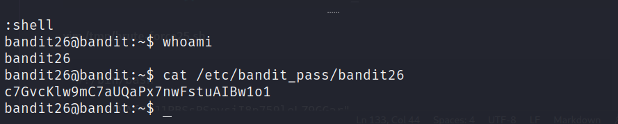

# [Bandit Level 25-26](https://overthewire.org/wargames/bandit/bandit26.html)

## Descrição original
Logging in to bandit26 from bandit25 should be fairly easy… The shell for user bandit26 is not /bin/bash, but something else. Find out what it is, how it works and how to break out of it.

## Introdução
O objetivo desse level é descobrir o shell que o usuário **bandit26** está utilizando, como ele funciona e como contorná-lo para me autenticar.

## Comandos utilizados:

```
ssh: permite que você acesse e controle um computador remoto de forma segura, como se estivesse interagindo diretamente com a máquina.

-p: determina em qual porta a conexão com o servidor será realizada.

-i: especifica o arquivo de chave privada a ser usado para autenticação de chave pública durante a conexão SSH.
```

```
whoami: exibe o nome do usuário que está atualmente logado no terminal ou no sistema operacional.
```

```
cat: exibe o conteúdo de um ou mais arquivos de texto diretamente no terminal.
```

```
vim: é um editor de texto altamente configurável e poderoso, amplamente utilizado em sistemas Unix-like, como Linux. 

:wq (Write and Quit): Ao combinar os comandos :w e :q, você pode salvar as alterações no arquivo e sair do Vim ao mesmo tempo.
```

```
man: usado para acessar páginas de manual que fornecem informações detalhadas sobre os comandos, funções e utilitários do sistema.
```

```
|: redireciona a saída de um comando para a entrada de outro.
```
```
grep: é uma ferramenta de busca de padrões que examina o texto de entrada e retorna as linhas que correspondem ao padrão especificado. 
```

```
more: exibe o conteúdo de um arquivo de texto, uma página por vez, permitindo que você role pelo texto.
```


## Resolução

```
┌──(lufeltz㉿lufeltz)-[~]
└─$ ssh bandit25@bandit.labs.overthewire.org -p 2220
```

Logo após iniciar essa conexão com o **ssh** informo o password obtido no desafio anterior.

```
bandit25@bandit.labs.overthewire.org's password: p7TaowMYrmu23Ol8hiZh9UvD0O9hpx8d
```

```console
bandit25@bandit:~$ whoami
bandit25
```

Vejo quais arquivos estão no diretório home:
```console
bandit25@bandit:~$ ls
bandit26.sshkey
```

Encontro uma chave SSH, porém ao tentar me conectar com ela a conexão é fechada imediatamente:

```console
bandit25@bandit:~$ ssh bandit26@localhost -p 2220 -i bandit26.sshkey 
```
```
The authenticity of host '[localhost]:2220 ([127.0.0.1]:2220)' can't be established.
ED25519 key fingerprint is SHA256:C2ihUBV7ihnV1wUXRb4RrEcLfXC5CXlhmAAM/urerLY.
This key is not known by any other names
Are you sure you want to continue connecting (yes/no/[fingerprint])? yes
```

```
Connection to localhost closed.
```

Seguindo a orientação do exercício vou procurar pelo shell que está sendo executado no usuário **bandit26**:

```console
bandit25@bandit:~$ cat /etc/passwd | grep bandit26
bandit26:x:11026:11026:bandit level 26:/home/bandit26:/usr/bin/showtext
```
    passwd é um arquivo de texto que armazena informações sobre os usuários do sistema.

Obtenho várias informações do **bandit26**, porém o que vai me interessar é a última parte **/usr/bin/showtext** que é o shell padrão do usuário, o qual é executado quando o usuário faz login e provavelmente é um programa personalizado que está sendo executado em vez de um shell tradicional.

Abro esse arquivo:

```console
bandit25@bandit:~$ cat /usr/bin/showtext
#!/bin/sh

export TERM=linux

exec more ~/text.txt
exit 0
```

Basicamente esse arquivo é um script que define a variável **TERM** para utilizar o terminal linux, depois o comando **more** executa um arquivo **text.txt** no diretório **home** e após finalizar sua execução encerra o script com **exit 0**.

Portanto caso o conteúdo desse arquivo **text.txt** se encaixe em uma única página, o **more** exibe tudo instantaneamente e retorna o controle ao script para que ele continue a execução e feche a conexão. Isso pode causar o fechamento rápido da conexão estabelecida.

Então se o conteúdo for menor que uma página, tudo que preciso fazer é diminuir o tamanho da página antes de realizar a conexão ssh para que o **more** funcione corretamente e pause a execução do script.


Ao dar uma olhada no manual do comando **more** encontro a opção **v** que me permite abrir um editor na linha atual:

```console
bandit25@bandit:~$ man more
v: Start up an editor at current line. The editor is taken from the environment variable VISUAL if defined, or EDITOR if VISUAL is not defined, or defaults to vi(1) if neither VISUAL nor EDITOR is defined.
```

Outro detalhe importante é que se não for configurada nenhuma das variáveis de ambiente **VISUAL** ou **EDITOR** o editor **vi** será aberto no lugar.

Aperto então **v** para abrir o editor na linha atual:


Parece ser o editor vi ou vim, então vou tentar alterar o **shell** usando o comando **:set shell=/bin/bash**, para configurar o shell padrão do editor para ser o shell Bash.


Após isso tento abrir o shell com **:shell**.


Funcionou e agora estou autenticado como o usuário **bandit26**:


Verifico então o arquivo de password desse usuário:


Dessa forma encontro o password do próximo level **bandit26**:

    c7GvcKlw9mC7aUQaPx7nwFstuAIBw1o1


Por fim saio do usuário **bandit26** utilizando o **esc** e depois **:q** para sair do **vi** e por ultimo aperto a **barra de espaço** para finalizar o comando **more**.


Depois saio do usuário **bandit25** por meio do comando exit.
```console
bandit25@bandit:~$ exit
logout
Connection to bandit.labs.overthewire.org closed.
```