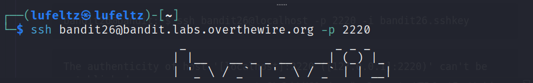
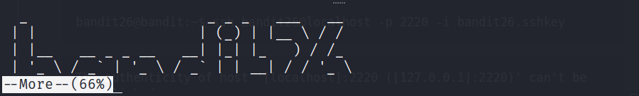
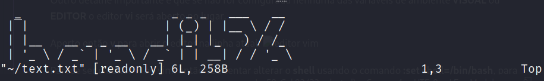
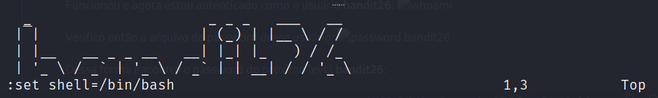
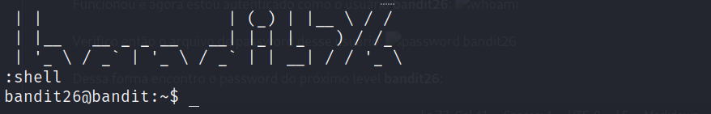
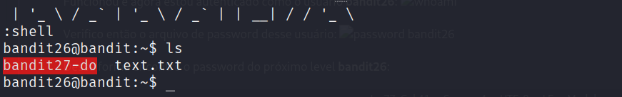
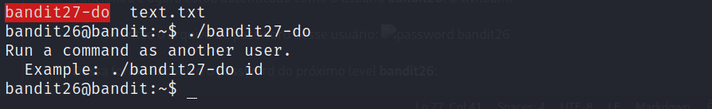
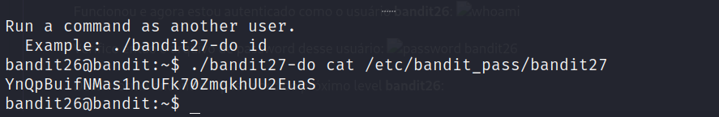
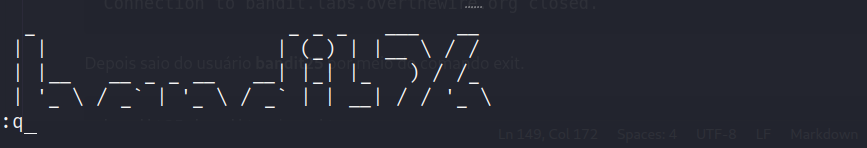
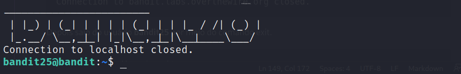

# [Bandit Level 26-27](https://overthewire.org/wargames/bandit/bandit27.html)

## Descrição original
Good job getting a shell! Now hurry and grab the password for bandit27!

## Introdução
O objetivo desse level é me aproveita da shell que consegui no desafio anterior e obter o password do level **bandit27.**

## Comandos utilizados:

```
ssh: permite que você acesse e controle um computador remoto de forma segura, como se estivesse interagindo diretamente com a máquina.

-p: determina em qual porta a conexão com o servidor será realizada.
```

```
cat: exibe o conteúdo de um ou mais arquivos de texto diretamente no terminal.
```

```
vim: é um editor de texto altamente configurável e poderoso, amplamente utilizado em sistemas Unix-like, como Linux. 
```

```
more: exibe o conteúdo de um arquivo de texto, uma página por vez, permitindo que você role pelo texto.
```

## Resolução

```
┌──(lufeltz㉿lufeltz)-[~]
└─$ ssh bandit26@bandit.labs.overthewire.org -p 2220
```

Logo após iniciar essa conexão com o **ssh** informo o password obtido no desafio anterior.

```console
bandit26@bandit.labs.overthewire.org's password: c7GvcKlw9mC7aUQaPx7nwFstuAIBw1o1
```
```
Connection to bandit.labs.overthewire.org closed.
```

Assim como no exercício anterior não será possível abrir esse terminal em uma tela comum, sendo necessário diminuir o seu tamanho para manter a conexão aberta por meio do comando **more**:





Novamente uso a opção **v** para abrir um editor na linha atual:


Parece ser o editor vi ou vim, então vou tentar alterar o **shell** usando o comando **:set shell=/bin/bash**, para configurar o shell padrão do editor para ser o shell Bash.


Após isso tento abrir o shell com **:shell**.


Funcionou e agora estou autenticado como o usuário **bandit26**.

Utilizo o comando **ls** para consultar o que tenho no meu diretório **home** e encontro um **setuid** do usuário **bandit27:**


    Um setuid é um tipo especial de arquivo binário em sistemas linux que possui a permissão "setuid" ativada. O termo "setuid" é uma abreviação de "Set User ID upon execution", o que significa que o processo que executa o binário assume temporariamente os privilégios do proprietário do arquivo, em vez dos privilégios do usuário que está executando o processo.

Tento executá-lo e assim como em exercícios anteriores esse **setuid** me permite executar um comando como outro usuário:


Uso esse **setuid** e busco pelo password do **bandit27**:


Dessa forma encontro o password do próximo level **bandit27**:

    YnQpBuifNMas1hcUFk70ZmqkhUU2EuaS

Por fim saio do usuário **bandit26** utilizando o **esc** e depois :**q** para sair do **vi** e por ultimo aperto a **barra de espaço** para finalizar o comando **more**.




