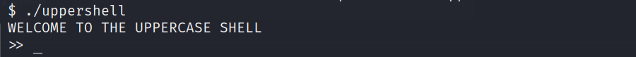

# [Bandit Level 32-33](https://overthewire.org/wargames/bandit/bandit33.html)

## Descrição original
After all this git stuff its time for another escape. Good luck!

## Introdução
O objetivo desse level é realizar mais uma escapatória(encontrar o password) depois de tudo que foi mostrado sobre o **git**.

## Comandos utilizados:

```
ssh: permite que você acesse e controle um computador remoto de forma segura, como se estivesse interagindo diretamente com a máquina.

-p: determina em qual porta a conexão com o servidor será realizada.
```

```
ls: lista o conteúdo do diretório especificado.

-l: mostra detalhes adicionais sobre cada arquivo, incluindo permissões, proprietário, grupo, tamanho, data de modificação e nome.

-a: inclui os arquivos ocultos no resultado da listagem. Os arquivos ocultos são aqueles cujos nomes começam com um ponto.
```

```
whoami: exibe o nome do usuário que está atualmente logado no terminal ou no sistema operacional.
```

```
cat: exibe o conteúdo de um ou mais arquivos de texto diretamente no terminal.
```


## Resolução

```
┌──(lufeltz㉿lufeltz)-[~]
└─$ ssh bandit32@bandit.labs.overthewire.org -p 2220
```

Logo após iniciar essa conexão com o **ssh** informo o password obtido no desafio anterior.

```
bandit32@bandit.labs.overthewire.org's password: rmCBvG56y58BXzv98yZGdO7ATVL5dW8y
```

Após colocar o password do **bandit32** recebo a mensagem de boas vindas **WELCOME TO THE UPPERCASE SHELL:**


A partir da indicação dada na mensagem, parece provável que qualquer entrada fornecida será convertida em letras maiúsculas. Essa suspeita é confirmada quando testo comandos, visto que não apenas os comandos que inseri foram convertidos em maiúsculas, mas também não tenho autorização para executá-los.


Note que ao lado de cada mensagem de resposta existe um **sh** indicando que estou em um ambiente shell **sh.**

Realizo alguns experimentos com variáveis e percebo que, embora não consiga executar os conteúdos armazenados na variável **teste** que criei, não recebo nenhum tipo de mensagem de erro. Isso me leva a concluir que é viável utilizar variáveis nesta situação.


Conforme apontado anteriormente a cada resposta recebo também um **sh** indicando que o ambiente shell atual é o **sh.** Já que estou em um shell que não me permite executar praticamente nenhum comando, procuro formas para tentar abrir um novo terminal. Uma forma de fazer isso é utilizando a variável **$0.**

    O valor da variável $0 reflete o nome do shell que está sendo executado, ou seja, quando o shell é iniciado usando o comando "sh", o valor da variável $0 é definido como "sh", que é o nome do shell que está sendo executado. 

Isso pode ser confirmado com um teste simples, veja no exemplo a seguir que o valor da variável **$0** é inicialmente **/usr/bin/zsh** que é o meu shell padrão, porém após abrir o shell **sh** o valor dela é alterado para **sh**.


Sabendo disso faço a execução da variável **$0** que abre um novo shell dentro do shell atual, mas dessa vez sem modificar meus comandos para letras maiúsculas:


Agora tenho acesso aos comandos básicos e como pode ser visto estou atualmente no usuário **bandit33**:


Listo os arquivos do diretório atual para confirmar se não há mais nada que posso utilizar, mas não encontro nada de significante.


O arquivo uppershell é o que inicia o **UPPERCASE SHELL:**



Já que sou o usuário **bandit33**, vejo o conteúdo do arquivo **/etc/bandit_pass/bandit33:**


Dessa forma encontro o password do próximo level **bandit33**:

    odHo63fHiFqcWWJG9rLiLDtPm45KzUKy

Por fim saio do usuário atual começando pelo shell **sh** e depois do **UPPERCASE SHELL** utilizando o **ctrl + c**.

