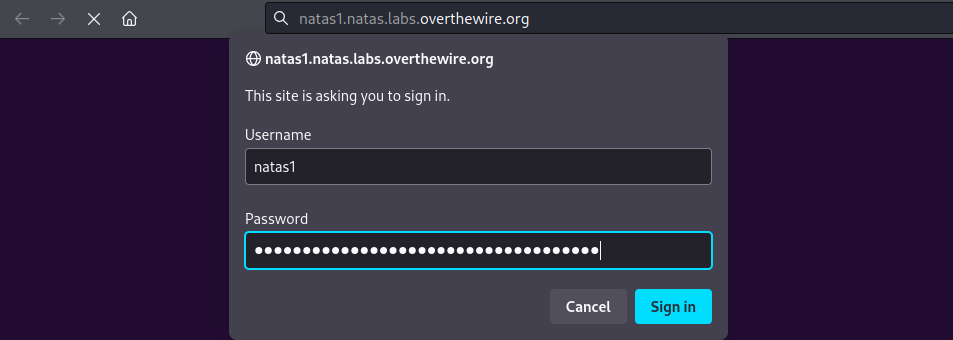
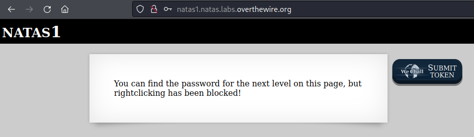
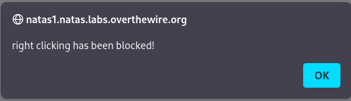
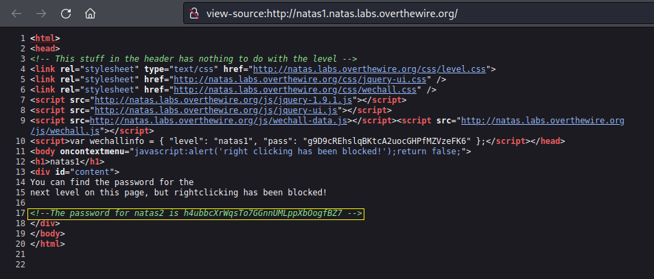

# [Natas Level 0-1](https://overthewire.org/wargames/natas/natas1.html)

### Objetivo
O objetivo desse level é encontrar dentro da página web o password para o próximo level **natas2**, porém sem o uso do click com o botão direito já que isso está bloqueado.

### Credenciais para autenticação no desafio

Username: natas1

Password: g9D9cREhslqBKtcA2uocGHPfMZVzeFK6

URL: http://natas1.natas.labs.overthewire.org

### Resolução

Começo esse desafio abrindo a URL informada nas instruções e me autenticando no usuário **natas1**:

 

Após me autenticar recebo uma mensagem indicando que posso encontrar o password para o próximo level nessa página, porém clicar com o botão direito na página foi bloqueado, ou seja não posso inspecionar o código fonte da página desse jeito.

 

Tentando clicar com o botão direito uma outra mensagem me confirma esse bloqueio:

 

Mas já que gosto de usar atalhos no teclado, posso simplesmente usar **Ctrl + U**, como fiz no desafio anterior. Isso funciona bem, como pode ser visto aqui:

 

Dessa forma encontro o password para o próximo level **natas2:**

    h4ubbcXrWqsTo7GGnnUMLppXbOogfBZ7