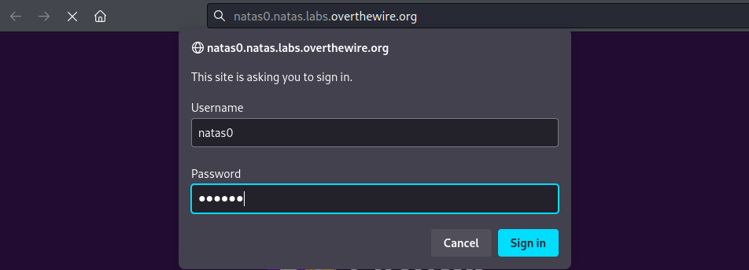
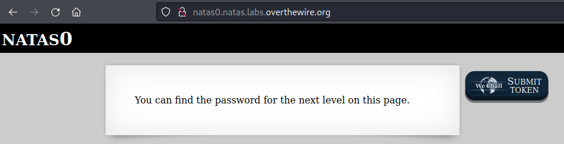
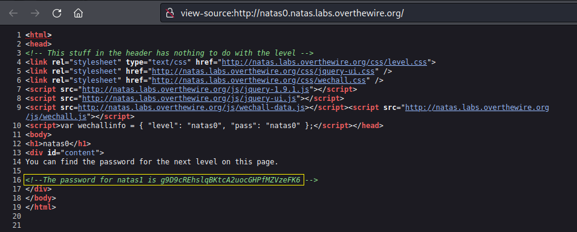

# [Natas Level 0](https://overthewire.org/wargames/natas/natas0.html)

### Objetivo
O objetivo desse level é encontrar dentro da página web o password para o próximo level **natas1** .

### Credenciais para autenticação no desafio

Username: natas0

Password: natas0

URL: http://natas0.natas.labs.overthewire.org

### Resolução

Começo esse desafio abrindo a URL informada nas instruções e me autenticando com o usuário e senha <b>natas0</b>:

 

Após me autenticar recebo uma mensagem indicando que posso encontrar o password para o próximo level nessa página:

 

Já que é comum ter algo comentado no código fonte da página, abro ele com <b>ctrl + u</b> e localizo facilmente o password para o próximo level <b>natas 1.</b>

 

Password para o próximo level <b>natas1:</b>

    g9D9cREhslqBKtcA2uocGHPfMZVzeFK6