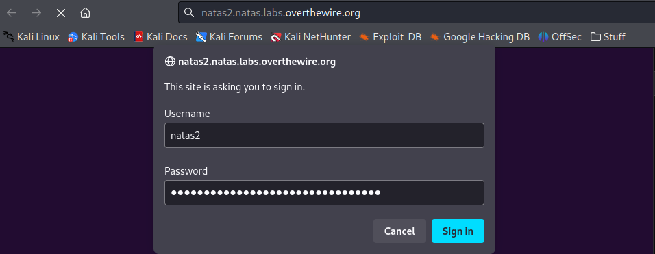
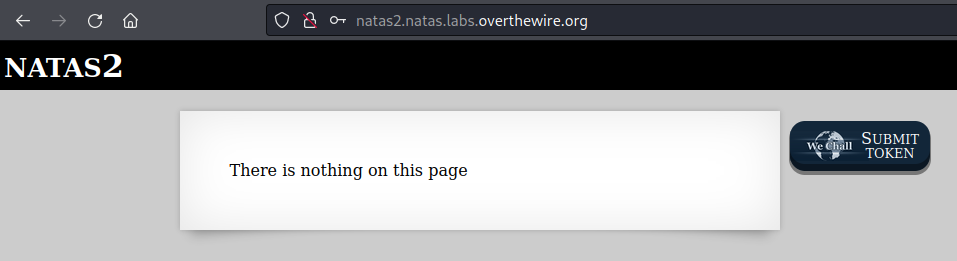
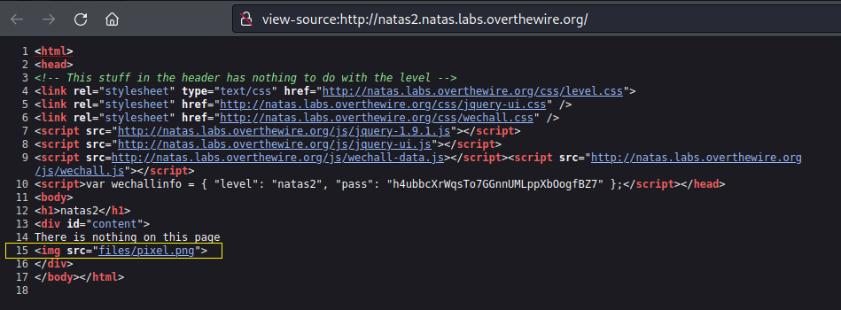
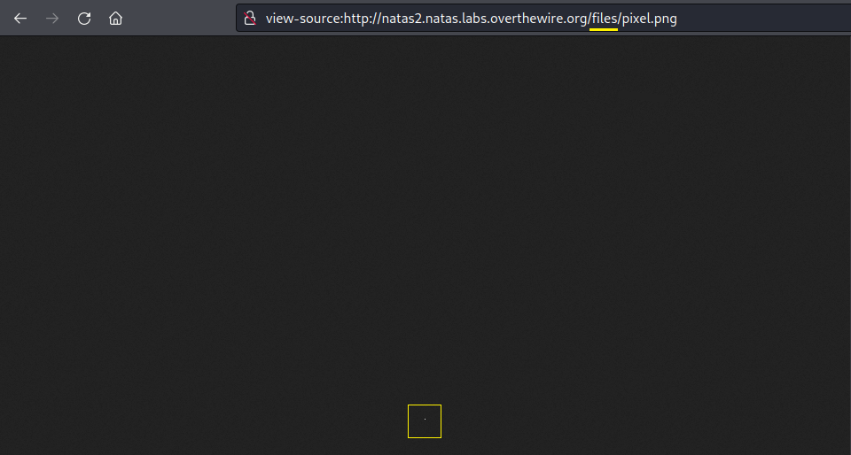
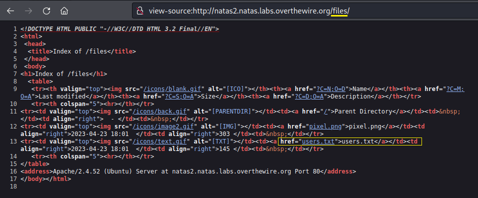
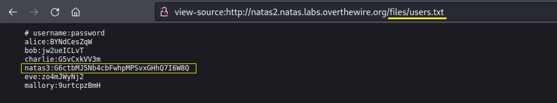

# [Natas Level 1-2](https://overthewire.org/wargames/natas/natas2.html)

### Objetivo
O objetivo desse level é encontrar dentro da página web o password para o próximo level **natas3**, possuindo como única descrição que o password não está nessa página(página inicial).

### Credenciais para autenticação no desafio

Username: natas2

Password: h4ubbcXrWqsTo7GGnnUMLppXbOogfBZ7

URL: http://natas2.natas.labs.overthewire.org

### Resolução

Começo esse desafio abrindo a URL informada nas instruções e me autenticando no usuário **natas2**:

 

Após me autenticar recebo uma mensagem indicando que não existe nada naquela página, parece ser uma dica de que vou precisar encontrar um outro diretório onde provavelmente está o password do usuário **natas3**. 

Abro o código fonte buscando alguma informação relevante e localizo um link do diretório **files** contendo a imagem **pixel.png:**

 

Ao acessar o link, sou direcionado para uma página que apresenta somente um pixel, exatamente como o nome da imagem sugere. No entanto isso não me ajuda muito, porém o diretório **files** onde essa imagem está pode conter algo interessante. Assim, minha próxima ação será explorar o seu conteúdo para obter mais informações.

 

Faço uma alteração na URL apagando o final **/pixel.png** deixando somente **/files** e após acessar esse endereço me deparo com os vários arquivos armazenados, mas um arquivo me chama a atenção: **users.txt**, onde muito provavelmente existem informações sobre os usuários desse sistema:

 

Clico nesse arquivo de texto e sou redirecionado para uma página com credenciais de vários usuários incluindo o do **natas3**:

Dessa forma encontro o password para o próximo level **natas3:**

    G6ctbMJ5Nb4cbFwhpMPSvxGHhQ7I6W8Q