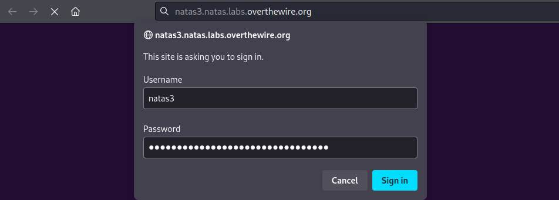
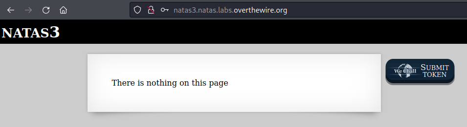
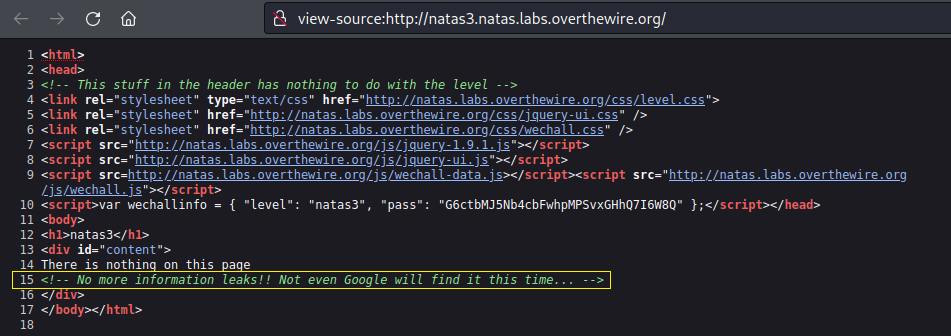
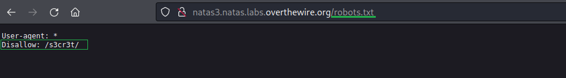
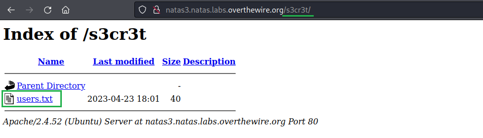
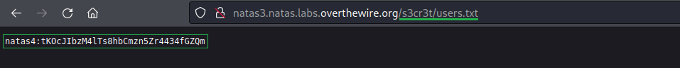

# [Natas Level 2-3](https://overthewire.org/wargames/natas/natas3.html)


### Objetivo
O objetivo desse level é encontrar dentro da página web o password para o próximo level **natas4**, possuindo como única descrição que o password não está nessa página(página inicial).


### Credenciais para autenticação no desafio

Username: natas3

Password: G6ctbMJ5Nb4cbFwhpMPSvxGHhQ7I6W8Q

URL: http://natas3.natas.labs.overthewire.org


### Resolução

Começo esse desafio abrindo a URL informada nas instruções e me autenticando no usuário **natas3**:



<br>

Após me autenticar recebo uma mensagem indicando que não existe nada naquela página, parece ser uma dica de que vou precisar encontrar um outro diretório onde provavelmente está o password do usuário **natas4**, igual ao desafio anterior. 



<br>

Abro o código fonte da página(**Ctrl + U**) e procuro por alguma informação relevante assim como no level anterior, porém dessa vez encontro apenas uma mensagem me informando que não existem mais vazamentos de informações e ainda sou informado que nem mesmo o google vai encontrar o arquivo dessa vez:



<br>

Espera aí! Nem mesmo o Google? Uma forma de evitar que tanto o Google quanto outros mecanismos de busca encontrem um arquivo específico é bloquear a indexação, o que é feito através de um arquivo chamado **robots.txt**.

```
Um indexador, também conhecido como robô de mecanismo de busca, é um programa automatizado que percorre a internet e examina o conteúdo de sites da web para coletar informações. Essas informações são posteriormente usadas para indexar ou catalogar o conteúdo dos sites em um mecanismo de busca, como o Google, Bing ou outros.
```

O proprietário de um site usa o arquivo **/robots.txt** para dar instruções aos robôs da web, isso é conhecido como The Robots Exclusion Protocol(Protocolo de Exclusão de Robôs).

O processo é o seguinte: um robô deseja acessar uma URL de um site, por exemplo:
    
    http://www.exemplo.com/bem-vindo.html. 
    
Antes de fazer isso, ele primeiro verifica se há um arquivo **robots.txt**:

    http://www.exemplo.com/robots.txt

Nesse exemplo o **robots.txt** tem o seguinte conteúdo:

    User-agent: *
    Disallow: /teste.txt

Cada parte do conteúdo significa:

    User-agent: * significa que esta seção se aplica a todos os robôs. 

    Disallow: /teste.txt" indica ao robô que ele não deve acessar o arquivo /teste.txt.

Sabendo disso acesso o arquivo **/robots.txt** e vejo que existe um arquivo chamado **s3cr3t** que o Google não vai conseguir encontrar(indexar):



<br>

Altero o caminho da URL para **/s3cr3t** e me deparo com o arquivo **users.txt**:



<br>

Clico nesse arquivo e as credenciais do usuário **natas4**:




<br>


Dessa forma encontro o password para o próximo level **natas4:**

    tKOcJIbzM4lTs8hbCmzn5Zr4434fGZQm