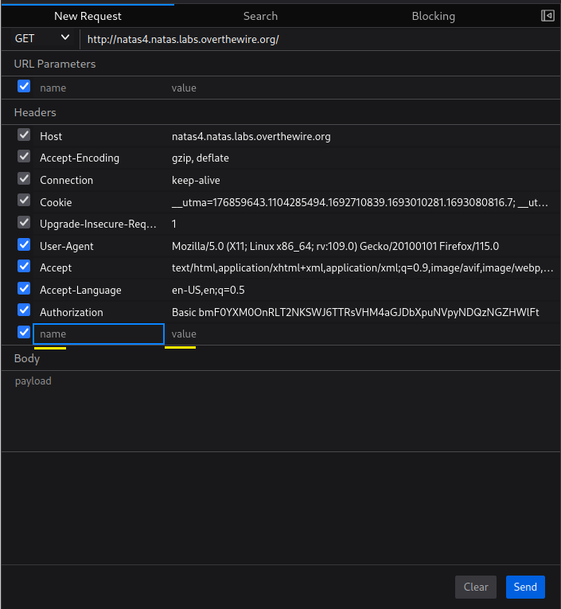

# [Natas Level 3-4](https://overthewire.org/wargames/natas/natas4.html)


### Objetivo
O objetivo desse level é encontrar o password para o próximo level **natas5**, porém é necessário que eu visite a página principal do desafio **natas4** me originando do domínio **http://natas5.natas.labs.overthewire.org/**, o qual não tenho acesso atualmente.


### Credenciais para autenticação no desafio

```
Username: natas4
```
```
Password: tKOcJIbzM4lTs8hbCmzn5Zr4434fGZQm
```
```
URL: http://natas4.natas.labs.overthewire.org
```

### Resolução

Começo esse desafio abrindo a URL informada nas instruções e me autenticando no usuário **natas4**:


<br>

Após realizada a autenticação uma mensagem aparece me informando que o meu acesso não é permitido(**Access disallowed**), pois eu estou vindo da origem "" enquanto que somente usuários que vierem da origem **"http://natas5.natas.labs.overthewire.org"** são autorizados a acessar esse conteúdo:


<br>

Pelo que parece se eu encontrar uma forma de falsificar a minha origem eu vou conseguir acessar o conteúdo dessa página tranquilamente.

Buscando informações de como o servidor sabe de onde eu estou vindo, encontrei que o cabeçalho **Referer** desempenha esse papel. 

    O cabeçalho Referer é um campo presente nas solicitações HTTP que informa ao servidor da página de destino a origem da solicitação, ou seja, qual página ou recurso nos trouxe até aqui. Resumindo, é o cabeçalho Referer que conecta o ponto de partida ao destino atual.


Com essa descoberta, o próximo passo é manipular ou incluir o cabeçalho para mascarar a minha origem. Uma das maneiras de fazer isso é por meio do Developer Tools(Ferramentas de Desenvolvedor), disponível em todos os navegadores (no momento, estou usando o Mozilla).

Começo abrindo o Developer Tools(**F12**), em seguida clico na aba **Network** e atualizo a página com **F5**. Após realizar esses passos consigo visualizar as diversas requisições realizadas pelo meu navegador para o servidor **natas4**, porém a requisição que vai me interessar é a que faz a requisição da página raiz **/** que normalmente é a página principal da aplicação.


<br>

Ao acessar essa solicitação, vejo uma página que apresenta os cabeçalhos usados na requisição, e entre eles, os **Request Headers**, que desempenham um papel central neste desafio. São esses cabeçalhos que têm importância na obtenção do conteúdo da página. Além disso vou utilizar a opção **Resend** que me permite inserir e/ou modificar cabeçalhos antes de enviá-los


<br>

Clicando em **Resend** tenho a opção de criar um cabeçalho e definir o seu valor:



<br>

Crio então o cabeçalho **Referer** com o valor **http://natas5.natas.labs.overthewire.org** e envio a requisição com **Send**:


<br>

Uma página com a resposta da requisição é aberta onde consta o password para o próximo desafio:


<br>

Dessa forma encontro o password para o próximo level **natas5:**

    Z0NsrtIkJoKALBCLi5eqFfcRN82Au2oD