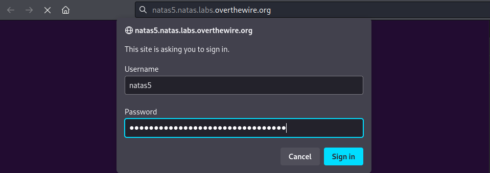
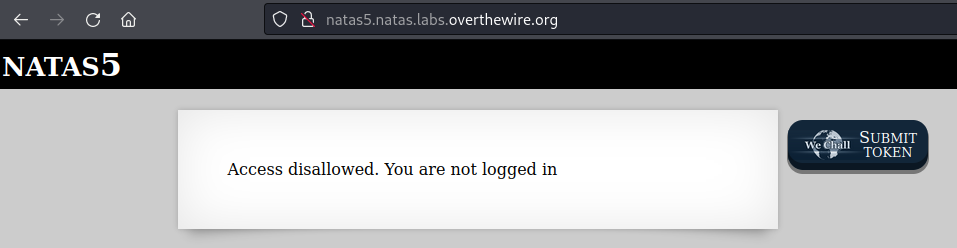
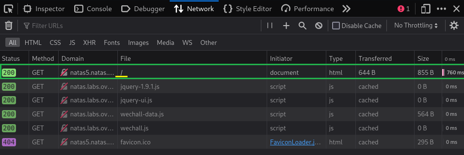
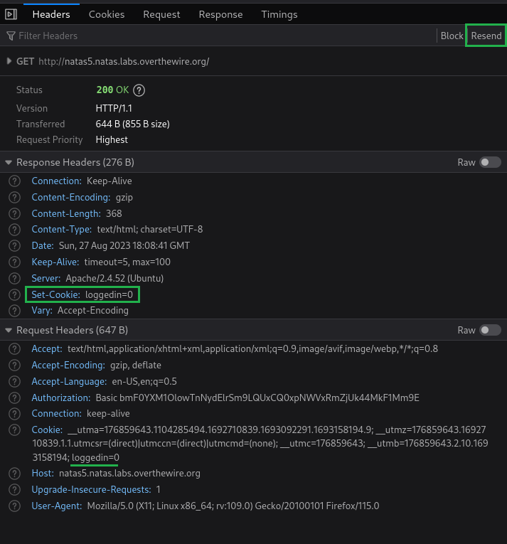
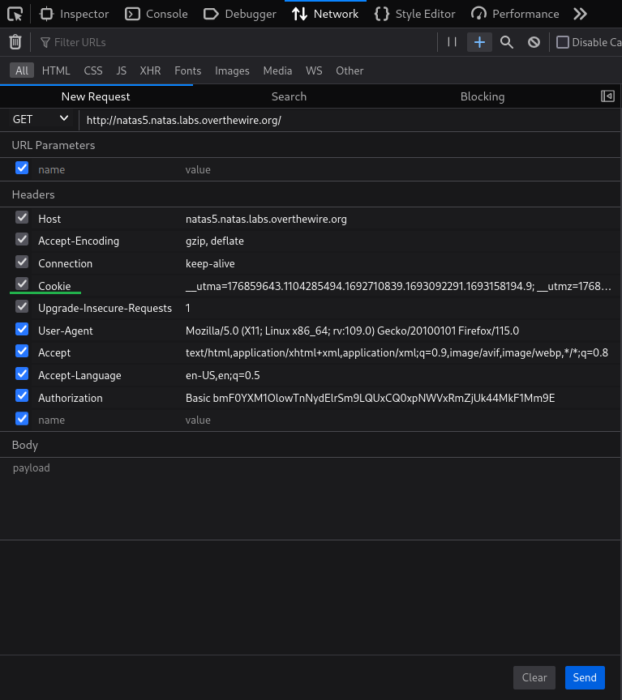
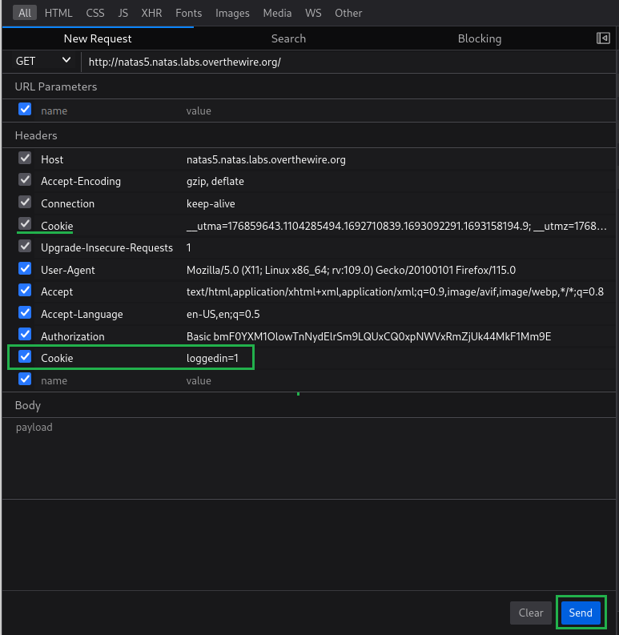
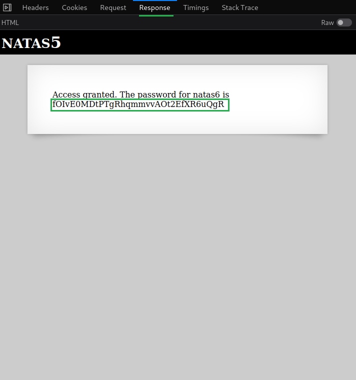

# [Natas Level 4-5](https://overthewire.org/wargames/natas/natas5.html)


### Objetivo
O objetivo desse level é encontrar o password para o próximo level **natas6**, porém sendo necessário primeiro ter realizado o login na página, ou parecer estar logado.


### Credenciais para autenticação no desafio

```
Username: natas5
```
```
Password: Z0NsrtIkJoKALBCLi5eqFfcRN82Au2oD
```
```
URL: http://natas5.natas.labs.overthewire.org
```

### Resolução

Começo esse desafio abrindo a URL informada nas instruções e me autenticando no usuário **natas5**:



<br>

Após realizada a autenticação uma mensagem aparece me informando que o meu acesso não é permitido(**Access disallowed**), devido a não estar logado na página:




<br>

Provavelmente ao logar o password será mostrado, porém como eu realizo o login? e como o servidor sabe que eu não estou logado?

Para responder essas perguntas vou verificar como as requisições são realizadas. Uma das maneiras de fazer isso é por meio do Developer Tools(Ferramentas de Desenvolvedor), disponível em todos os navegadores(no momento, estou usando o Mozilla).

Começo abrindo o Developer Tools(**F12**), em seguida clico na aba **Network** e atualizo a página com **F5**. Após realizar esses passos consigo visualizar as diversas requisições realizadas pelo meu navegador para o servidor **natas5**, porém a requisição que vai me interessar é a que faz a requisição da página raiz **/** que normalmente é a página principal da aplicação.



<br>

Ao acessar essa solicitação, vejo uma página que apresenta os cabeçalhos usados tanto na requisição quanto na resposta do servidor. Dentre essas informações nos cabeçalhos de resposta(**Response Headers**) vejo que um cookie é definido pelo cabeçalho **Set-Cookie** com o valor **loggedin=0** o que geralmente representa um usuário deslogado. 

Logo abaixo nos cabeçalhos da requisição(**Request Headers**) vejo que estou enviando um cabeçalho **Cookie** com o valor **loggedin=0** que provavelmente é como o servidor sabe que não estou logado. Isso me faz pensar e se eu fizesse uma alteração nesse cookie para o valor **loggedin=1**?.



<br>

Clicando em **Resend** no topo da aba **Headers** tenho a opção de criar um cabeçalho e definir o seu valor, porém note que o cabeçalho **Cookie** está cinza e não me permite a sua alteração direta.

    Isso indica que o cookie é seguro (Secure) e/ou foi definido como HttpOnly. Essas configurações de segurança impedem a modificação do cookie através do navegador, especialmente se ele estiver sendo usado para autenticação ou informações sensíveis.





Um detalhe interessante é que apesar de não ser possível modificá-lo eu posso sobrescrevê-lo, bastando criar um novo cabeçalho com o mesmo nome e modificar o seu valor.

    Ao adicionar um novo cabeçalho "Cookie" em uma solicitação HTTP, eu estou efetivamente substituindo quaisquer cookies existentes que estivessem presentes na solicitação anterior.


Crio então um novo cabeçalho chamado **Cookie** porém com o valor **loggedin=1** e envio a requisição clicando em **Send.**



<br>

Após enviar a requisição clico na aba **Response** e obtenho a resposta da minha requisição e consequentemente o password do próximo desafio:



<br>

Dessa forma encontro o password para o próximo level **natas6:**

    fOIvE0MDtPTgRhqmmvvAOt2EfXR6uQgR