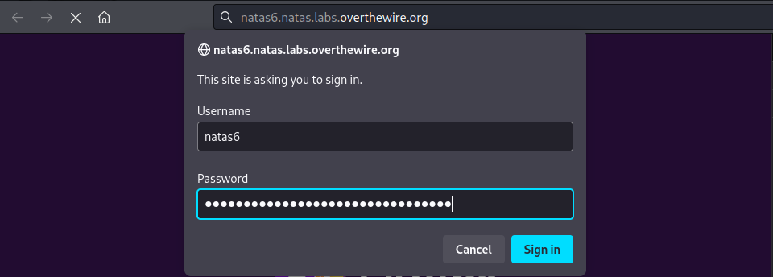
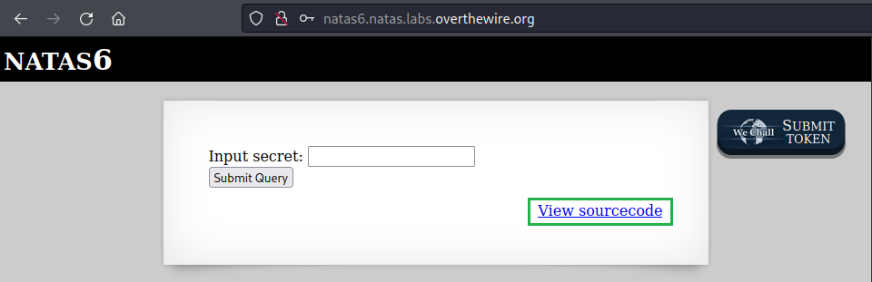
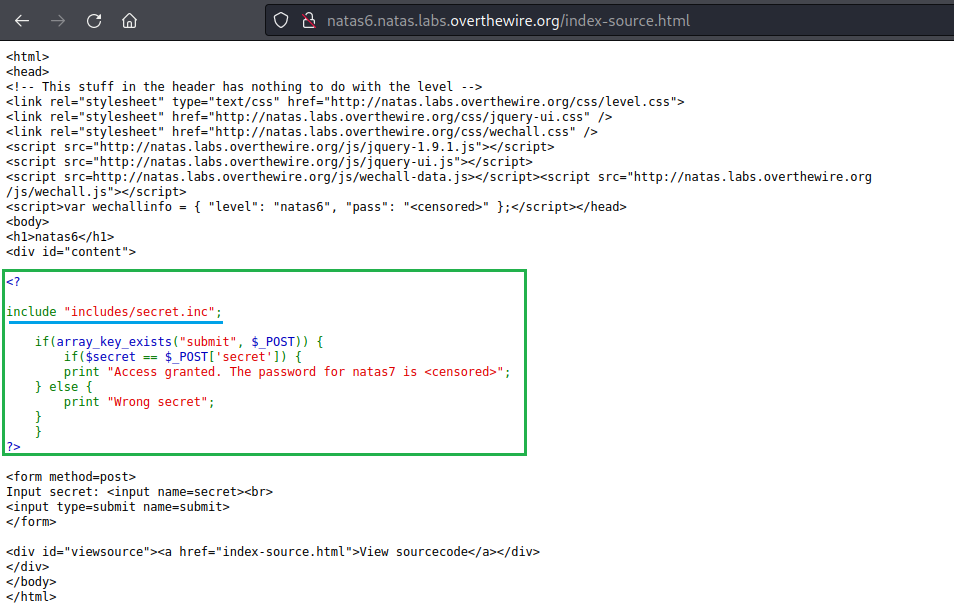
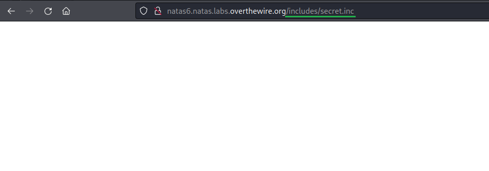
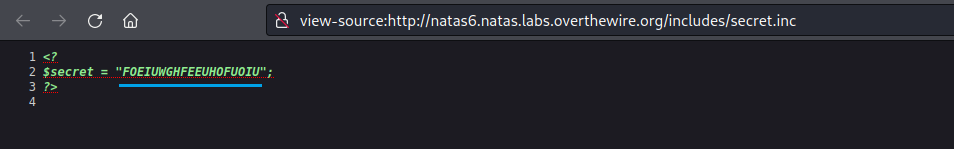
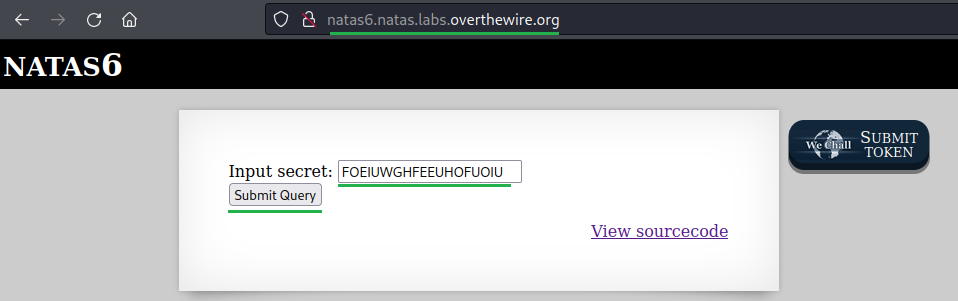
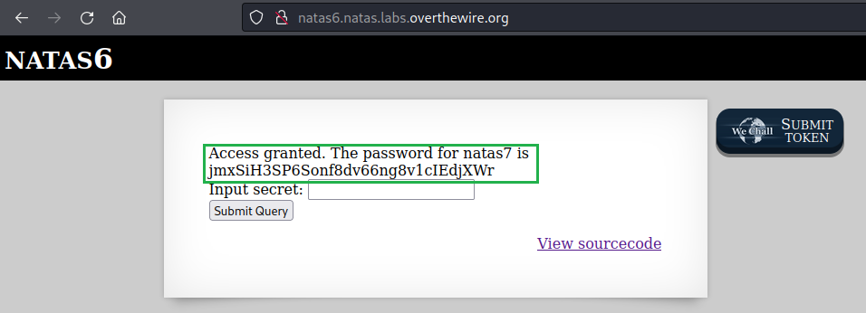

# [Natas Level 5-6](https://overthewire.org/wargames/natas/natas6.html)


### Objetivo
O objetivo desse level é encontrar o password para o próximo level **natas7** por meio do submit de uma string secreta.


### Credenciais para autenticação no desafio

```
Username: natas6
```
```
Password: fOIvE0MDtPTgRhqmmvvAOt2EfXR6uQgR
```
```
URL: http://natas6.natas.labs.overthewire.org
```

### Resolução

Começo esse desafio abrindo a URL informada nas instruções e me autenticando no usuário **natas6**:



<br>

Após realizada a autenticação, um campo para colocar um segredo(uma string secreta) aparece, muito provavelmente após colocá-la vou obter o password do próximo level. Além disso um link para o código fonte também é fornecido o que usarei a seguir.




<br>

Quando visito o link, vejo um código **HTML** comum e no meio dele, um código **PHP** que verifica se o que for inserido(**$_POST('secret')**) no campo **submit** é igual a um segredo(**$secret**). Se for igual, recebo a senha para o próximo nível. Se não for, vejo uma mensagem de erro dizendo que o segredo está errado(**Wrong secret**).

Note que tenho uma variável **$secret** que não está definida nesse código **PHP**, mas que pode estar vindo de um outro arquivo o que parece ser o caso aqui já que a primeira linha desse código inclui o conteúdo do arquivo **secret.inc** no código atual:

    include "includes/secret.inc";




<br>

Faço uma tentativa de acessar o conteúdo desse arquivo, porém recebo uma página em branco:



<br>

A página pode estar em branco, mas o seu código fonte pode ter algum conteúdo, abro então o código fonte com **Ctrl + U** e localizo a variável **$secret** e seu valor:



    FOEIUWGHFEEUHOFUOIU


Com esse valor copiado volto a página inicial e coloco ele no campo de input e clico no botão **Submit Query**:




<br>

A aplicação então me retorna um password:



<br>

Dessa forma encontro o password para o próximo level **natas7:**

    jmxSiH3SP6Sonf8dv66ng8v1cIEdjXWr