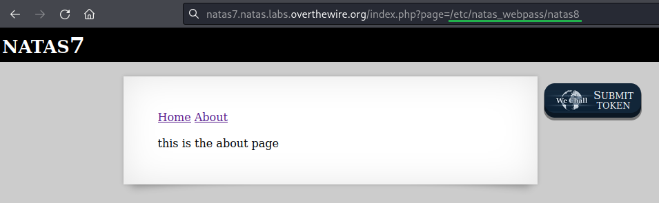

# [Natas Level 6-7](https://overthewire.org/wargames/natas/natas7.html)


### Objetivo
O objetivo desse level é encontrar o password para o próximo level **natas8**. Sem maiores informações inicialmente.


### Credenciais para autenticação no desafio

```
Username: natas7
```
```
Password: jmxSiH3SP6Sonf8dv66ng8v1cIEdjXWr
```
```
URL: http://natas7.natas.labs.overthewire.org
```

### Resolução

Começo esse desafio abrindo a URL informada nas instruções e me autenticando no usuário **natas7**:


<br>

Após realizada a autenticação, a página inicial aparece onde existem dois links, um para a página **Home** e outro para a página **About**.


<br>

Clicando no primeiro link **Home** a página home com uma mensagem dizendo que aquela é a **front page**(primeira página) é mostrada:


<br>

Acessando o link **About** sou redirecionado para a página a seguir onde é mostrado uma mensagem simples de que aquela é a página **about**, note também que a URL mudou para **page=about**. Já que não aparenta ter algo interessante aqui, vou procurar no código fonte por maiores informações.


<br>

Abro o código fonte da página com **Ctrl + U** e encontro uma dica(**hint**) que me informa que o password para o usuário **natas8** está em **/etc/natas_webpass/natas8**:


<br>

Como eu já sei o caminho para encontrar o password tudo que preciso é alterar a **URL** para acessar esse caminho. Da mesma forma como o valor do parâmetro **page** é alterado de **home** para **about** ao clicar no link, vou modificá-lo dessa vez alterando para o caminho **/etc/natas_webpass/natas8**:



<br>

Ao realizar o acesso obtenho o password:


<br>

Dessa forma encontro o password para o próximo level **natas8:**

    a6bZCNYwdKqN5cGP11ZdtPg0iImQQhAB