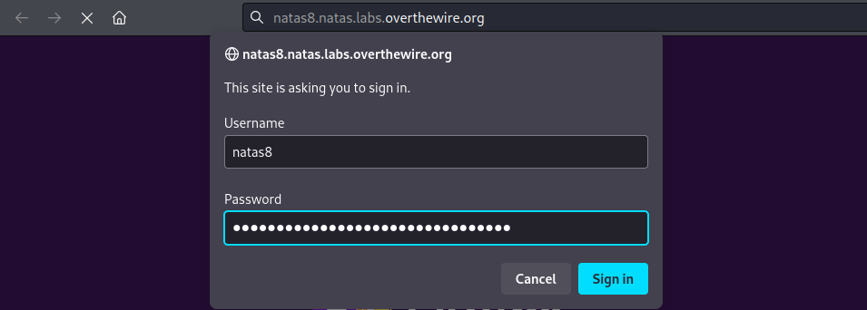
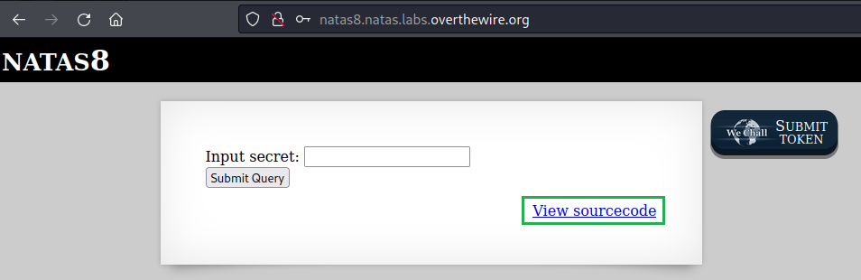
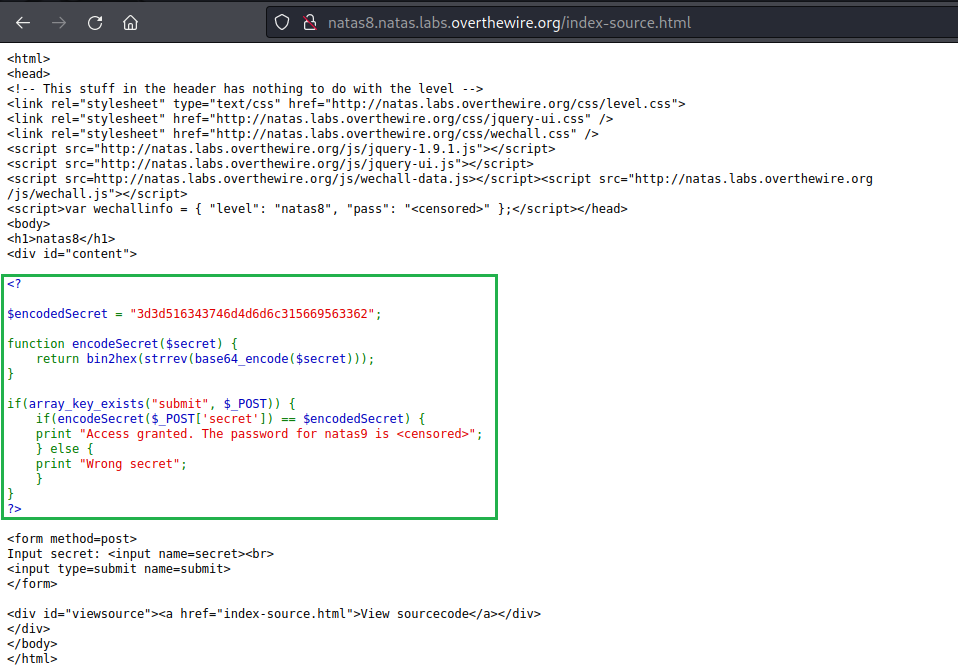
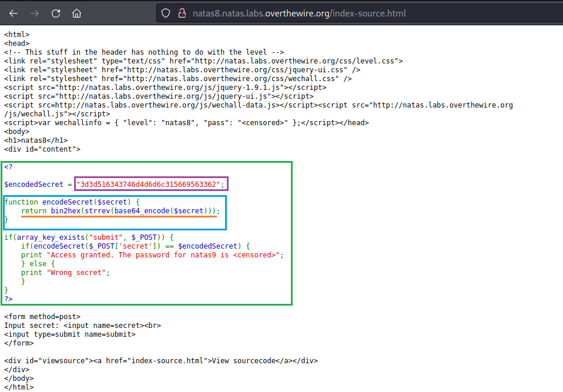
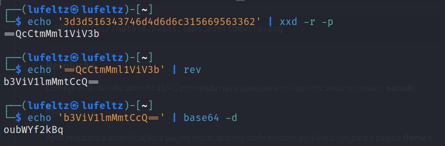
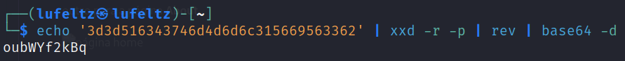
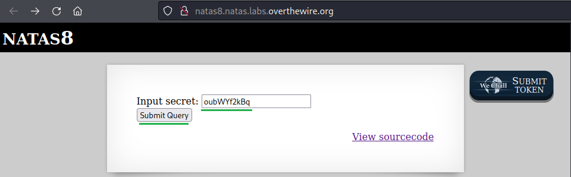
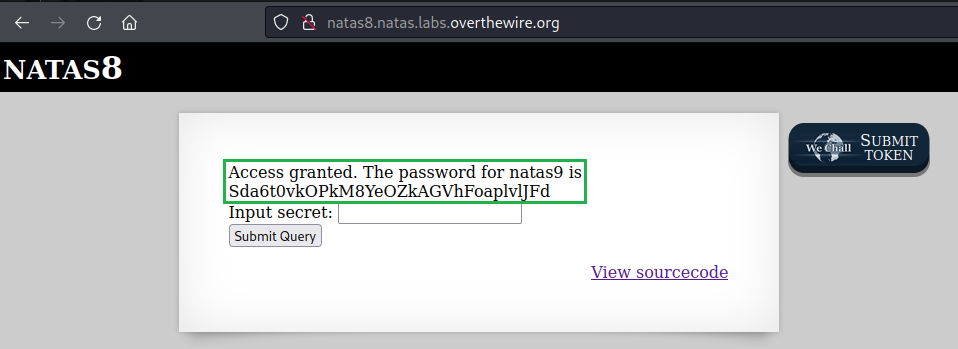

# [Natas Level 7-8](https://overthewire.org/wargames/natas/natas8.html)


### Objetivo
O objetivo desse level é encontrar o password para o próximo level **natas9** por meio do submit de uma string secreta.


### Credenciais para autenticação no desafio

```
Username: natas8
```
```
Password: a6bZCNYwdKqN5cGP11ZdtPg0iImQQhAB
```
```
URL: http://natas8.natas.labs.overthewire.org
```

### Resolução

Começo esse desafio abrindo a URL informada nas instruções e me autenticando no usuário **natas8**:



<br>

Após realizada a autenticação, um campo de input para colocar um segredo(**secret**) e um link para visualizar o código fonte são mostrados. Esse desafio parece ser semelhante a um anterior, então vou começar visualizando o código fonte clicando em **View sourcecode**.



<br>

Na página que se abre encontro um código PHP que faz uma codificação da variável **$encodeSecret** antes de compará-la com o que for colocado no campo de input e se o input for correto recebo o password para o level **natas9**:



<br>

Na próxima imagem está ocorrendo o seguinte:

**Código PHP (Retângulo Verde):** Esse segmento de código em PHP é o núcleo da operação. Ele controla todo o processo e direciona a execução das funções necessárias.

**Segredo (Roxo):** O conteúdo exibido em roxo representa o "segredo" que precisa ser criptografado.

**Função de Criptografia (Azul):** A seção em azul refere-se a  função encodeSecret que executa a criptografia do "segredo". Essa função recebe o "segredo" como entrada e retorna uma nova versão criptografada.

**Funções de Modificação do Segredo (Sublinhado em Laranja):** A parte sublinhada em laranja indica as funções que são aplicadas ao "segredo" para codificá-lo. 




<br>


Já que eu possuo a variável que está sendo usada na comparação(**$encodedSecret**) e sei como está sendo feita a criptografia tudo o que preciso é decodificá-la e depois colocá-la no campo de input para obter o password do próximo desafio.

Alguns detalhes sobre as funções que estão sendo utilizadas:

    base64_encode($secret): A função base64_encode codifica o valor da variável $secret em uma representação em base64.

    strrev(...): A função strrev inverte a ordem dos caracteres na sequência resultante da etapa anterior.

    bin2hex(...): A função bin2hex converte a sequência de bytes resultante das etapas anteriores em uma representação hexadecimal. 


Como as funções são chamadas a partir da mais interna seguindo para as mais externas para criptografar, preciso fazer o caminho contrário para descriptografá-la:



<br>

O que está acontecendo no código acima e que pode ser visto de forma resumida na imagem abaixo é o seguinte:

    1 - Faço um echo do conteúdo da variável $encodedSecret.

    2 - Redireciono essa saída para um comando que reverte a sequência hexadecimal de volta para binário com xxd -r -p.

    3 - Realizo a inversão da ordem dos caracteres na sequência binária utilizando o comando rev.

    4 - Finalmente, faço a decodificação de base64 para obter o formato original da string.




<br>

String obtida ao fim do processo:

    oubWYf2kBq

Com essa string em mãos volto a página inicial, coloco ela no campo de input e clico em **Submit Query**



<br>

Recebo como retorno acesso garantido e um password:



<br>

Dessa forma encontro o password para o próximo level **natas9:**

    Sda6t0vkOPkM8YeOZkAGVhFoaplvlJFd