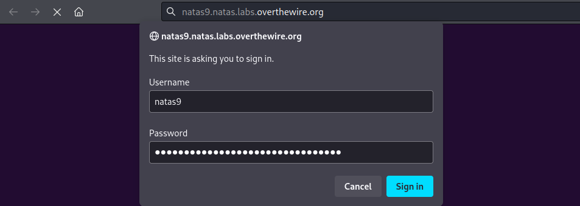
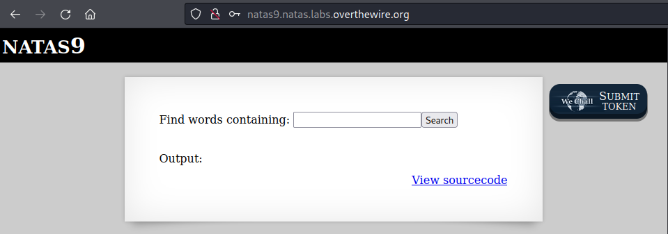
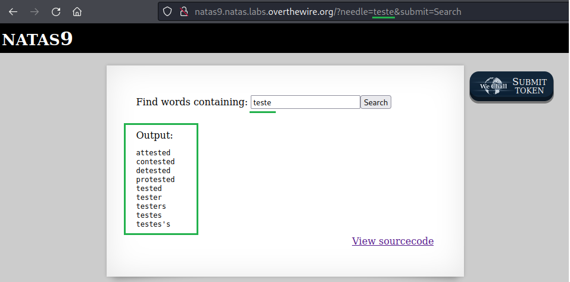

# [Natas Level 8-9](https://overthewire.org/wargames/natas/natas9.html)


### Objetivo
O objetivo desse level é encontrar o password para o próximo level **natas10**. Sem maiores informações além de um campo para pesquisa.


### Credenciais para autenticação no desafio

```
Username: natas9
```
```
Password: Sda6t0vkOPkM8YeOZkAGVhFoaplvlJFd
```
```
URL: http://natas9.natas.labs.overthewire.org
```

### Resolução

Começo esse desafio abrindo a URL informada nas instruções e me autenticando no usuário **natas9**:



<br>

Após realizada a autenticação, um campo de input para pesquisar por palavras que contenham o que eu escrever é mostrado, além de um link para visualizar o código fonte da aplicação:



<br>

Faço uma busca pela palavra **teste** e tenho como retorno várias outras palavras que contém essa palavra. Note que a URL também foi alterada onde o parâmetro **needle** possui como valor a palavra pela qual pesquisei:



<br>
