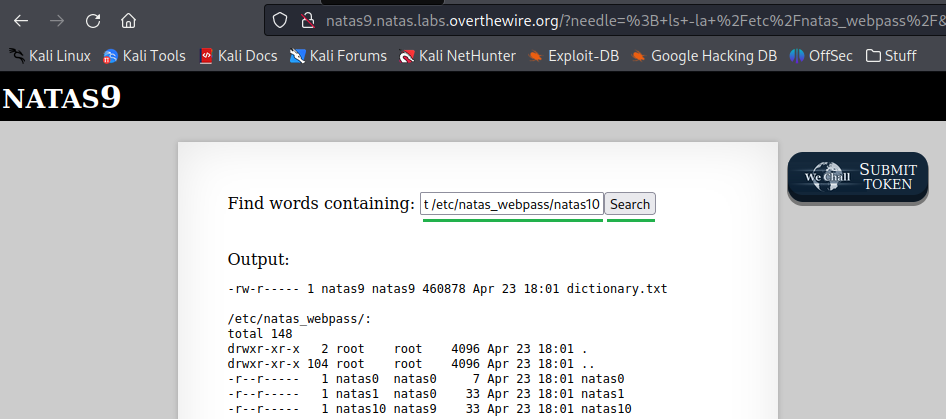

# [Natas Level 8-9](https://overthewire.org/wargames/natas/natas9.html)


### Objetivo
O objetivo desse level é encontrar o password para o próximo level **natas10**. Sem maiores informações além de um campo para pesquisa.


### Credenciais para autenticação no desafio

```
Username: natas9
```
```
Password: Sda6t0vkOPkM8YeOZkAGVhFoaplvlJFd
```
```
URL: http://natas9.natas.labs.overthewire.org
```

### Resolução

Começo esse desafio abrindo a URL informada nas instruções e me autenticando no usuário **natas9**:


<br>

Após realizada a autenticação, um campo de input para pesquisar por palavras e retornar outras palavras que contenham o que eu escrever é mostrado, além de um link para visualizar o código fonte da aplicação:


<br>

Faço uma busca pela palavra **teste** e tenho como retorno várias outras palavras que contenham **teste**. Note que a URL também foi alterada onde o parâmetro **needle** possui como valor a palavra pela qual pesquisei:


<br>

Para obter maiores detalhes do que está acontecendo clico em **View sourcecode** e sou redirecionado para uma página com o código fonte, porém o que vai me interessar é a parte com o código **PHP** a seguir:


<br>

No código acima cada parte representa o seguinte:

```
Inicializa a variável $key como uma string vazia.

$key = ""; 
```

```
array_key_exists("needle", $_REQUEST): Verifica se o campo de pesquisa("needle") foi enviado através de uma solicitação HTTP (GET ou POST).

Se "needle" estiver presente na solicitação, seu conteúdo é atribuído à variável $key.


if(array_key_exists("needle", $_REQUEST)) {
    $key = $_REQUEST["needle"];
}
```

```
Se $key não estiver vazio, a função passthru é usada para executar o comando grep -i $key dictionary.txt no sistema. 

grep: é um comando usado para buscar padrões em arquivos de texto.
-i: torna a busca insensível a maiúsculas e minúsculas.

if ($key != ""): Verifica se a variável $key não está vazia, ou seja, se alguém preencheu o campo de pesquisa.


if($key != "") {
    passthru("grep -i $key dictionary.txt");
}
```


Veja abaixo que a função **passthru** está executando um comando de pesquisa utilizando o que eu coloquei no campo de pesquisa:

    passthru("grep -i $key dictionary.txt");

    // Como pesquisei por teste o código executado seria:

    passthru("grep -i teste dictionary.txt");


Visualizando a documentação dessa função [passthru](https://www.php.net/manual/en/function.passthru.php) encontrei um aviso informando que ao permitir que o usuário insira os dados que serão passados para essa função, é recomendado usar funções para tratar essa entrada evitando que possam ser executados comandos de forma irrestrita.


<br>


Ao consultar o código PHP anteriormente não vi nenhuma função que tratasse a minha entrada, então faço um teste com **teste; ls -la**:

    teste; ls -la: 
    
    O ponto e vírgula (;) é usado para separar comandos na linha de comando e indicar que o comando anterior terminou e que o próximo comando deve ser executado independentemente do resultado do comando anterior. 

    ls -la: listará o conteúdo do diretório atual (incluindo arquivos e diretórios ocultos) com detalhes, como permissões, proprietário, grupo, tamanho e data de modificação.


<br>

Obtenho como resultado o arquivo **dictionary.txt** que está no diretório atual. Já que a injeção de código funcionou, tudo que preciso é uma forma de localizar o password para o level **natas10**.


<br>

Na página inicial do desafio é informado que todos os passwords ficam armazenados no diretório **/etc/natas_webpass/**. Logo só tenho que acessar o arquivo de password correto.


<br>

Faço uma listagem do conteúdo desse diretório usando o comando:

    ; ls -la /etc/natas_webpass/

    // o comando após ; vai ser executado independente do comando anterior, então mesmo que eu não coloque nada vai funcionar.


<br>


Tenho como resultado todos os passwords dos desafios natas, mas o que vai me interessar aqui é o desafio **natas10** o qual pode ser acessado pelo usuário **natas9**(meu usuário atual) já que ele pertence ao grupo **natas9**(marcado em laranja).


<br>

Acesso o conteúdo do arquivo **natas10** com o comando:

    ; cat /etc/natas_webpass/natas10



<br>

Por fim recebo como resultado o password para o próximo desafio **natas10**:


    D44EcsFkLxPIkAAKLosx8z3hxX1Z4MCE