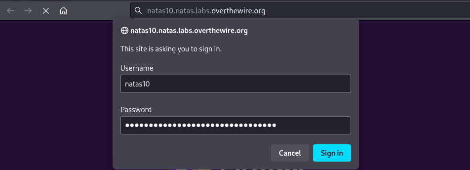
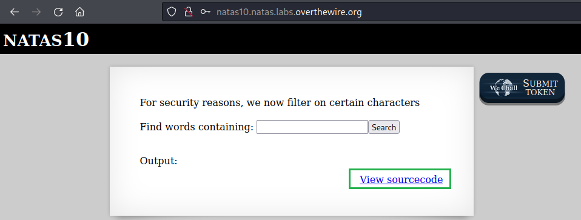
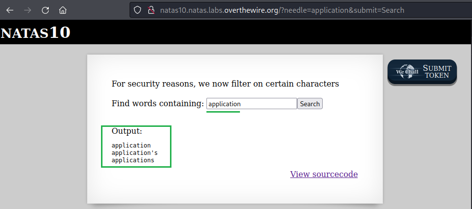
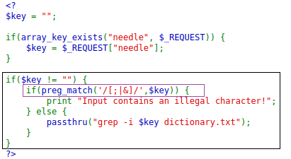
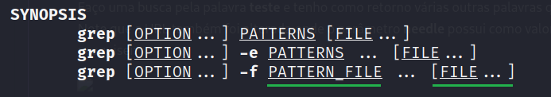
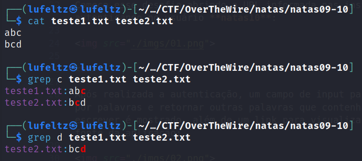
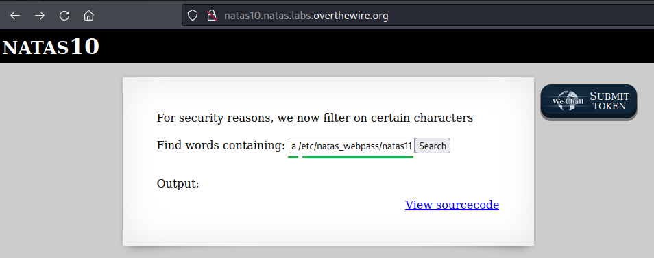
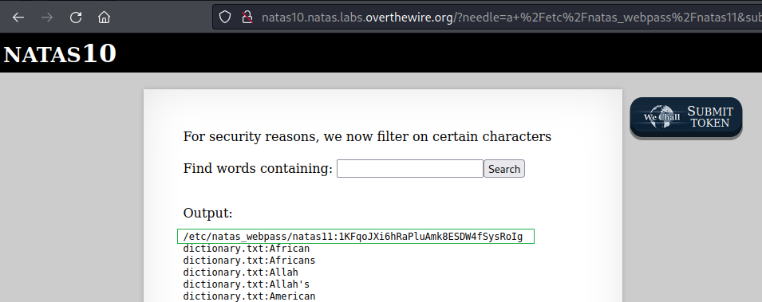

# [Natas Level 9-10](https://overthewire.org/wargames/natas/natas10.html)


### Objetivo
O objetivo desse level é encontrar o password para o próximo level **natas11**. Sem maiores informações além de um campo para pesquisa.


### Credenciais para autenticação no desafio

```
Username: natas10
```
```
Password: D44EcsFkLxPIkAAKLosx8z3hxX1Z4MCE
```
```
URL: http://natas10.natas.labs.overthewire.org
```

### Resolução

Começo esse desafio abrindo a URL informada nas instruções e me autenticando no usuário **natas10**:



<br>

Após realizada a autenticação, um campo de input para pesquisar por palavras e retornar outras palavras que contenham o que eu escrever é mostrado, porém também é informado que por questões de segurança alguns caracteres são filtrados. Além disso também existe um link para visualizar o código fonte da aplicação:



<br>

Faço uma busca pela palavra **application** e tenho como retorno várias outras palavras que contenham **application**, semelhante ao desafio anterior.



<br>

Clico em **View sourcecode** e sou redirecionado para uma página com o código fonte extenso, porém a parte que vai me interessar é a com o código **PHP** a seguir:



<br>

No desafio anterior [natas08-09](../natas08-09/README.md) contém um detalhamento desse código, então vou focar aqui somente na parte nova marcada em roxo:

```
Esse código verifica se a variável $key contém um dos caracteres ;, | ou &, por meio da função preg_match. Se encontrar um desses caracteres na string $key, ele imprime a mensagem "Input contains an illegal character!", caso não encontre a função passthru é executada.
```

Como vários caracteres estão sendo filtrados, busco outra forma para obter o password do level **natas11** e descubro o seguinte:

O código que é executado caso não tenha nenhum caractere considerado ilegal funciona desse jeito com a palavra **application**:

    
    grep -i $key dictionary.txt // Comando inicial

    grep -i application dictionary.txt // Após inserir application

Pesquiso um pouco sobre o comando **grep** e vejo que é possível procurar por um padrão em mais de um arquivo:



<br>

Nesse caso **PATTERN_FILE** é a palavra **application** e **FILE...** é o arquivo **dictionary.txt**, mas veja que existe **...** depois de **FILE** representando que podem ser feitas buscas em mais de um arquivo assim como demonstrado na próxima imagem:



<br>

O que está acontecendo acima é:

```
cat teste1.txt teste2.txt
    // mostra o conteúdo desses arquivos, respectivamente abc e bcd.

grep c teste1.txt teste2.txt
    // mostra que foi localizado a letra c tanto no primeiro quanto no segundo arquivo.

grep d teste1.txt teste2.txt
    // mostra que foi localizado a letra d somente no segundo arquivo.
```

Já que eu posso ler o conteúdo de um arquivo desde de que o padrão que eu estiver buscando exista nele, vou utilizar o comando **grep** para procurar a letra **a** nos dois arquivos:

    a /etc/natas_webpass/natas11

    // Ao colocar no campo de input o resultado seria esse:
    grep -i a /etc/natas_webpass/natas11 dictionary.txt

    // Utilizando a opção -i não importa se o a é maiúsculo ou minúsculo.



<br>


Assim como esperado obtenho no resultado tanto o conteúdo do arquivo **/etc/natas_webpass/natas11** quanto do arquivo **dictionary.txt:**



<br>


Dessa forma obtenho o password para o próximo level **natas11**:

    1KFqoJXi6hRaPluAmk8ESDW4fSysRoIg