# [Natas Level 10-11](https://overthewire.org/wargames/natas/natas11.html)


### Objetivo
O objetivo desse level é encontrar o password para o próximo level **natas12**. Além disso a descrição me informa que os cookies estão protegidos com uma criptografia XOR.


### Credenciais para autenticação no desafio

```
Username: natas11
```
```
Password: 1KFqoJXi6hRaPluAmk8ESDW4fSysRoIg
```
```
URL: http://natas11.natas.labs.overthewire.org
```

### Resolução

Começo esse desafio abrindo a URL informada nas instruções e me autenticando no usuário **natas11**:

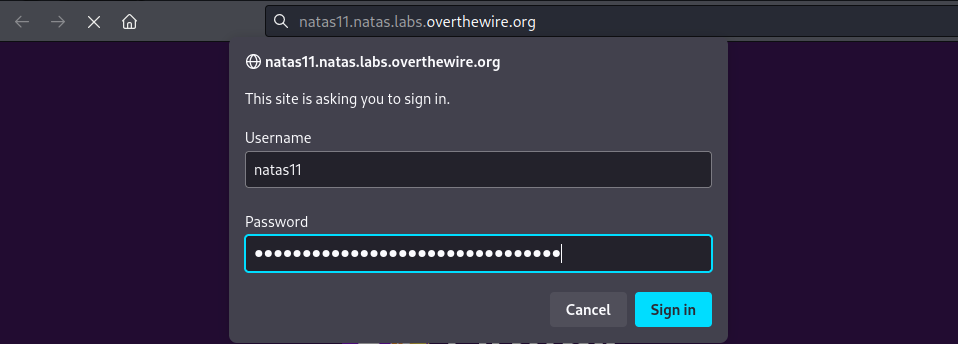

<br>

Após realizada a autenticação, um campo de input preenchido com o código da cor branca **#ffffff** e acima dele uma mensagem dizendo que os Cookies estão protegidos com a criptofrafia **XOR** são mostrados. Além disso, semelhante aos desafios anteriores, um link para visualizar o código fonte também é fornecido:

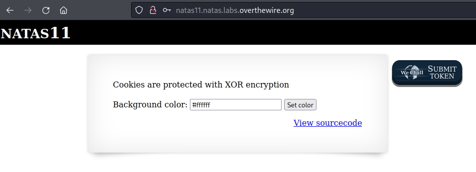

<br>

Como o próximo desafio informa que os cookies são criptografados usando **XOR**, provavelmente para resolver esse desafio vou precisar utilizar algo relacionado a essas duas coisas. Portanto vou inspecionar o código fonte em busca de informações relacionadas a esses dois assuntos:

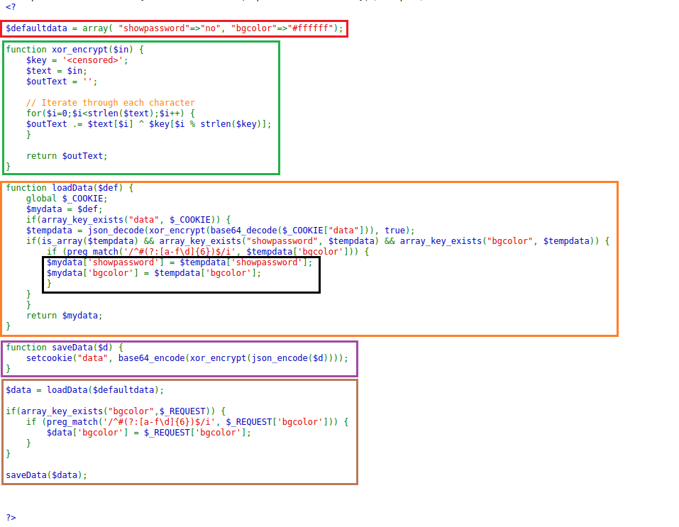

<br>

Encontro diversas informações no código fonte que resumidamente fazem o seguinte:

    Vermelho: Dados originais, um array com duas propriedades, showpassword e bgcolor. A primeira pode ser útil futuramente então vou manter ela em mente.

    Verde: Função para realizar a criptografia de uma entrada utilizando a criptografia XOR. Note que está sendo utilizada uma chave($key) a qual não tenho acesso atualmente.

    Laranja: Realiza a decodificação do valor do cookie e o utiliza para definir os valores da página web(background e password).

    Preto: No mesmo array onde é retornado o background também é definido o password do level, que não está sendo mostrado devido ao que foi definido no campo marcado em Vermelho.

    Roxo: Faz a criptografia XOR e depois base64 nos dados que forem recebidos e os salva em um cookie chamado data.

    Marrom: Confirma se o valor passado no campo de input é válido, caso seja a cor do background da página é alterada.


Já que foi mencionado Cookies vou dar uma olhada neles utilizando o atalho **F12** para abrir o **DevTools**(ferramentas de desenvolvedor), feito isso clico em **Storage** e depois em **Cookies** e vejo o cookie **data** que foi criado e o seu valor:

    MGw7JCQ5OC04PT8jOSpqdmkgJ25nbCorKCEkIzlscm5oKC4qLSgubjY%3D


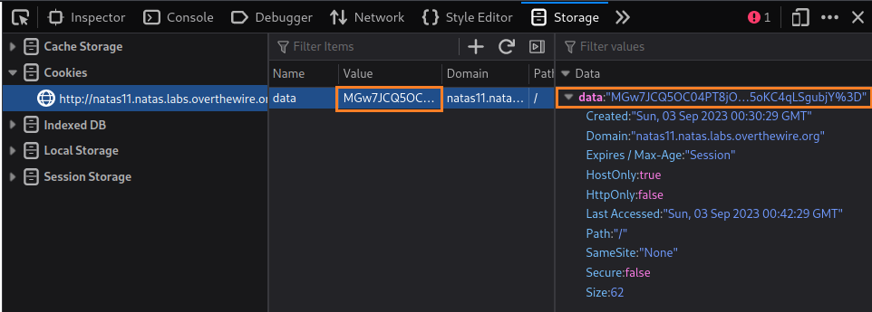

<br>

Antes de prosseguir um conhecimento que será essencial a respeito do **XOR**:

    O XOR tem uma propriedade chamada "propriedade comutativa" ou "propriedade do cancelamento", que permite três operações reversíveis distintas:

    1 - Chave Original + Dados Originais = Dados Codificados:
    Você pode aplicar o XOR entre a chave original e os dados originais para obter os dados codificados. Essa é a operação de criptografia, na qual os dados são protegidos usando a chave.

    2 - Chave Original + Dados Codificados = Dados Originais:
    A propriedade comutativa do XOR permite que, se você possui a chave original e os dados codificados, aplique o XOR entre eles para obter os dados originais. Isso é usado na operação de descriptografia, na qual os dados são recuperados usando a chave.

    3 - Dados Originais + Dados Codificados = Chave Original:
    Além disso, se você possui os dados originais e os dados codificados, pode calcular a chave original aplicando o XOR entre eles.

A opção 3 me parece ser totalmente viável, já que possuo o valor do cookie codificado e também os dados originais:

    Cookie codificado: MGw7JCQ5OC04PT8jOSpqdmkgJ25nbCorKCEkIzlscm5oKC4qLSgubjY%3D

    // Marcado em vermelho anteriormente:
    Dados originais: 
    array( "showpassword"=>"no", "bgcolor"=>"#ffffff")

O que preciso a partir daqui é criptografar os dados originais para **base64**, já que é o utilizado no cookie criptografado.

Vou usar a linguagem PHP já que é a utilizada no desafio. No código a seguir faço um encode dos dados originais para o formato **JSON** e depois a criptografia para **base64**, bem semelhante ao que é feito no código em roxo visto anteriomente:

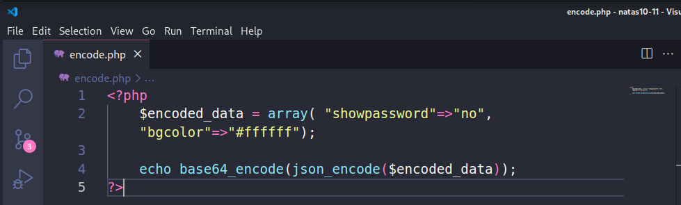

<br>

Depois de executar esse código obtenho o valor do cookie criptografado:

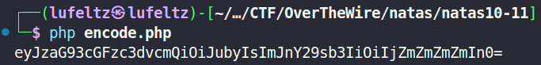

<br>

    eyJzaG93cGFzc3dvcmQiOiJubyIsImJnY29sb3IiOiIjZmZmZmZmIn0=


Para facilitar o trabalho de obtenção da chave vou utilizar a ferramenta [CyberChef](https://cyberchef.org/) que vai me auxiliar na descriptografia.

No **CyberChef** uso as formas de criptografia **From Base64** e **XOR**(a ordem é importante). Em resumo, marcado em verde está o valor criptografado do cookie **data**, em azul o valor do cookie recém criado e o seu formato, em vermelho as criptografias usadas e em laranja a key que está sendo utilizada para criptografar.

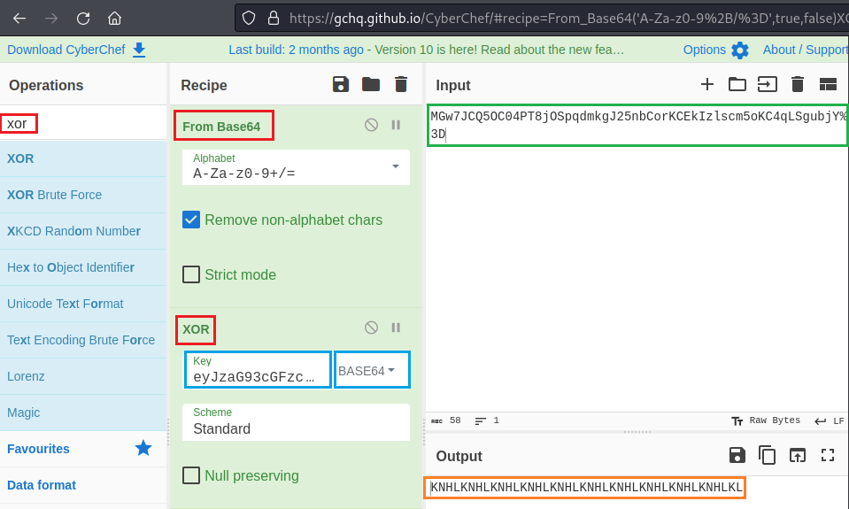

<br>


Alterei a key para **KNHL**(a chave está se repetindo, já que é menor que o valor que está sendo criptografado, então não preciso colocar o resto) obtida no passo anterior e seu formato para **UTF8**. Note que no fim do valor do cookie consta **%3D** que é o URL encode para **=**, e que está retornando uma letra **y** adicional, já que isso pode me dar problemas posteriormente vou alterá-lo para =.

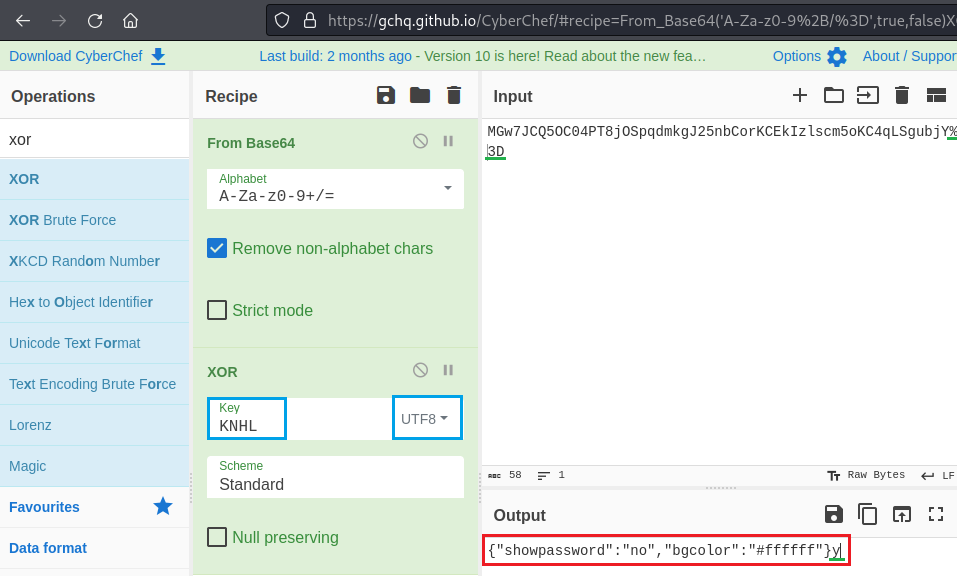

<br>

Após essa modificação obtenho o que está armazenado no valor desse cookie, como esperado são os dados originais, porém veja que a propriedade **showpassword** tem o valor **no**, o que aconteceria se eu alterasse para **"yes"**?

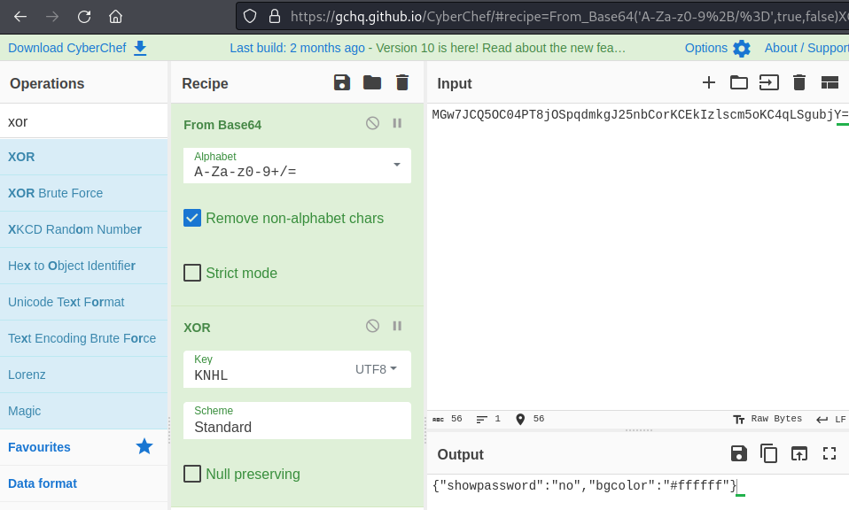

<br>

Altero as operações de criptografia para criptografar para **XOR** e depois para **base64**, exatamente como é feito no código marcado em roxo no código fonte e o valor de **showpassword** para **yes**, obtendo o seguinte valor:

    MGw7JCQ5OC04PT8jOSpqdmk3LT9pYmouLC0nICQ8anZpbS4qLSguKmkz

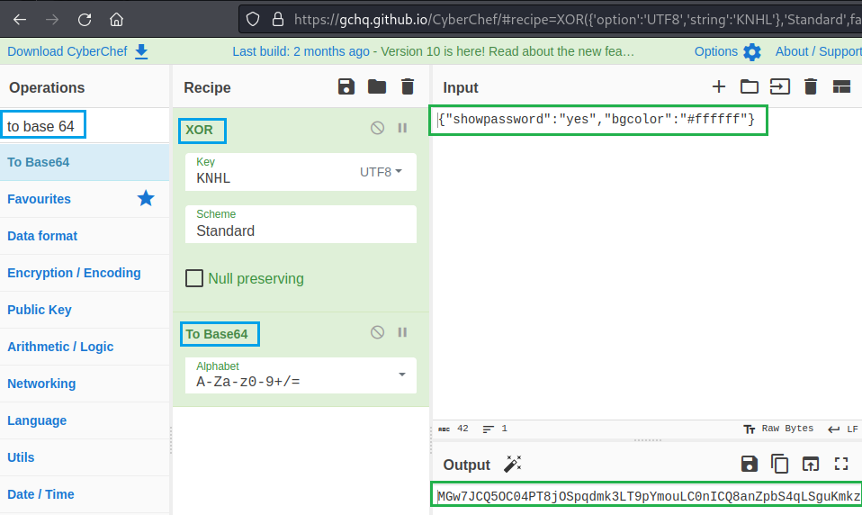

<br>


Abro novamente o **DevTools**, clico em **Storage** e depois em **Cookies** e altero o valor do cookie **data** para o que foi obtido e atualizo a página com **F5**.

    MGw7JCQ5OC04PT8jOSpqdmk3LT9pYmouLC0nICQ8anZpbS4qLSguKmkz

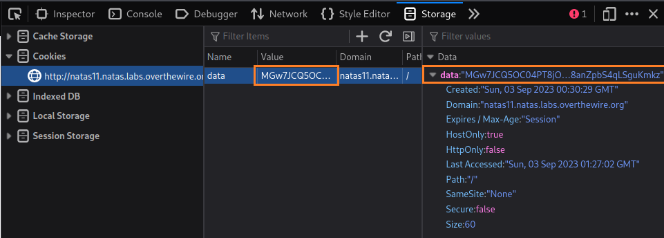

<br>

Uma mensagem com um password é mostrada:

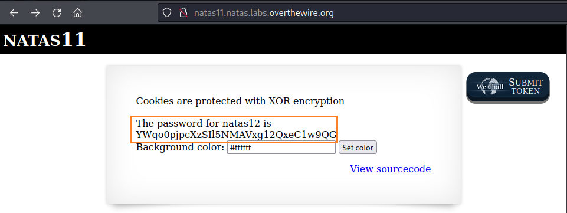

<br>

Isso ocorre porque no código é feita uma validação do valor de **showpassword** e caso ele seja **yes** o password do próximo desafio é mostrado:

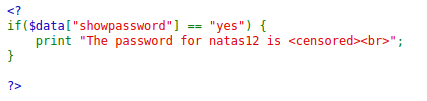

<br>

Dessa forma obtenho o password para o próximo level **natas12**:

    YWqo0pjpcXzSIl5NMAVxg12QxeC1w9QG