# [Natas Level 11-12](https://overthewire.org/wargames/natas/natas12.html)


### Objetivo
O objetivo desse level é encontrar o password para o próximo level **natas13**. Além disso um campo para realizar o envio de um arquivo é mostrado, então muito provavelmente vou precisar usar algum arquivo para completar esse desafio.


### Credenciais para autenticação no desafio

```
Username: natas12
```
```
Password: YWqo0pjpcXzSIl5NMAVxg12QxeC1w9QG
```
```
URL: http://natas12.natas.labs.overthewire.org
```

### Resolução

Começo esse desafio abrindo a URL informada nas instruções e me autenticando no usuário **natas12**:

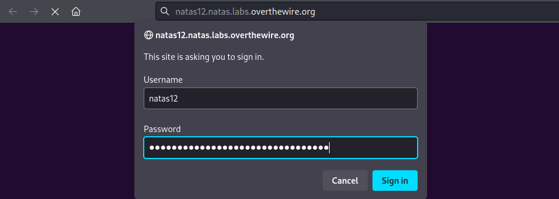

<br>

Após realizada a autenticação, uma mensagem para escolher um arquivo **JPEG** para enviar(tamanho máximo **1 KB**) e dois botões aparecem, um escrito **Browse...**(pesquisar) e outro escrito **Upload File**(enviar arquivo), consta também um link para visualizar o código fonte igual aos desafios anteriores:

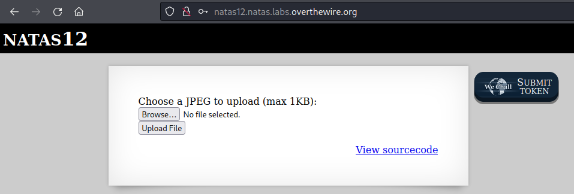

<br>

Começo criando um arquivo **teste.jpeg**(jpeg devido a descrição) para fazer um teste e depois clicando em **Browse...** para selecionar esse arquivo:

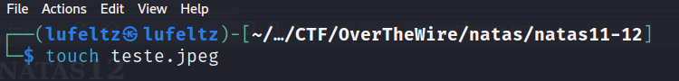


<br>

Ao clicar em **Upload File** sou redirecionado para uma outra página onde consta o diretório **upload/** que meu arquivo **teste.jpeg** está armazenado. Outro detalhe é que o nome do meu arquivo foi criptografado e sua extensão modificada para **jpg**, provavelmente para evitar colisões quando o nome de dois ou mais arquivos forem iguais:

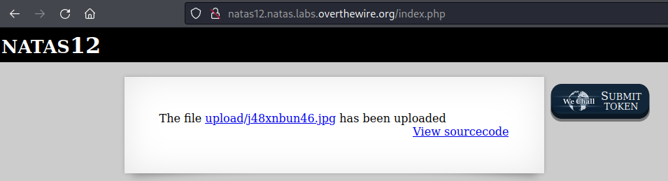

<br>

A descrição diz para escolher um arquivo **JPEG**, mas e se eu fizesse um envio de um arquivo com outra extensão?. Para descobrir isso crio o arquivo **teste.php**:

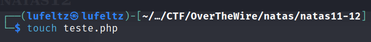

<br>

Pesquiso por esse arquivo e faço o seu envio. Obtenho como resposta um arquivo com o nome modificado e sua extensão alterada para **.jpg**:

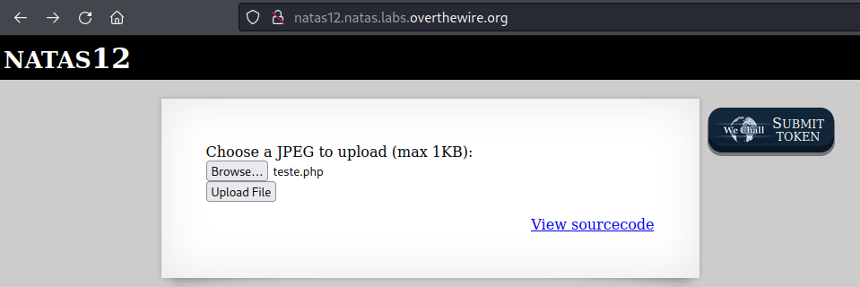
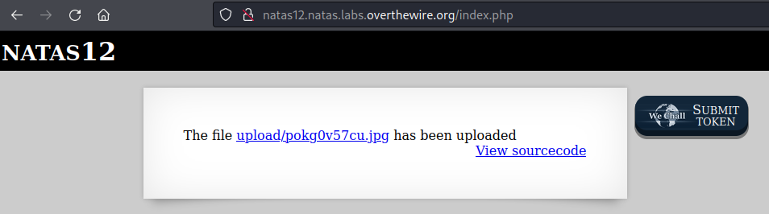

<br>

Clicando nesse link para o arquivo tenho como resposta uma mensagem de erro dizendo que meu arquivo não pode ser mostrado devido a conter erros:

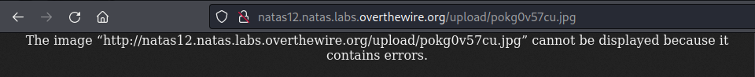

<br>

Volto a página anterior e clico em **View sourcode** que me retorna o seguinte:

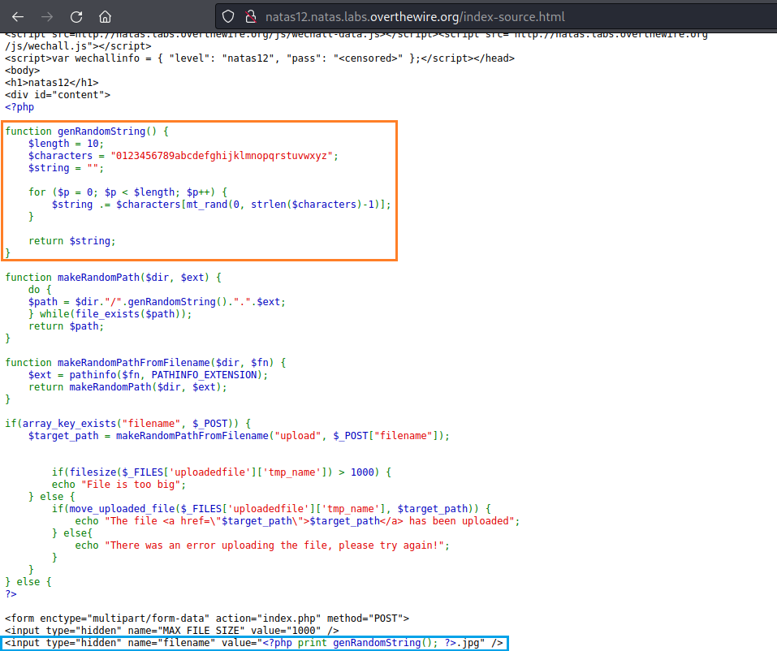

<br>

Em geral o que está ocorrendo no código é:
    
    Uma modificação do nome do arquivo na parte marcada em laranja.

    Algumas validações de se o arquivo é muito grande, se houve algum erro ou se é para mostrar o caminho do arquivo e uma mensagem de que ele foi enviado(igual foi recebido anteriormente).

    Em azul é mostrado o código responsável por mostrar o nome do arquivo modificado e sua extensão alterada para .jpg


Após os testes realizados e depois de visualizar esse código, cheguei a conclusão de que pode ser possível enviar um arquivo que me permita executar códigos no servidor e obter o password do level **natas13**. Para testar isso procurei por algum código php(devido ao código do servidor ser em php) que me permita executar comandos e encontrei o seguinte:

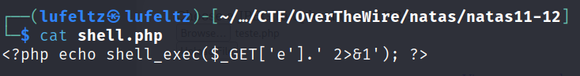

<br>

    <?php e ?>: Essas tags delimitam o início e o fim do código PHP. Todo o código PHP deve estar dentro dessas tags para ser executado.

    echo shell_exec(...): Esta linha de código está usando a função shell_exec para executar um comando do sistema operacional e imprimir o resultado na página da web.

    $_GET['e']: Isso está recuperando o valor de um parâmetro chamado 'e' da string de consulta da URL. O PHP possui um superglobal chamado $_GET que é usado para recuperar valores passados pela URL por meio de parâmetros.

    ' 2>&1': Este trecho de código é anexado ao comando passado como parte da string de consulta. Ele redireciona a saída de erro padrão (stderr) para a saída padrão (stdout) do comando. Isso é útil para capturar mensagens de erro e incluí-las no resultado impresso.


Deixo o arquivo **shell.php** recém criado pronto para ser enviado, porém antes de clicar em **Upload File**, vou precisar burlar a alteração da extensão para **.jpg** já que sem o **.php** o código do meu arquivo não vai ser executado.


<br>

Abro **DevTools**(ferramentas de desenvolvedor) com **F12** vou na aba Inspector e procuro pelo código que faz a modificação da extensão, o mesmo marcado em azul anteriormente, como pode ser visto a extensão está como **.jpg**:

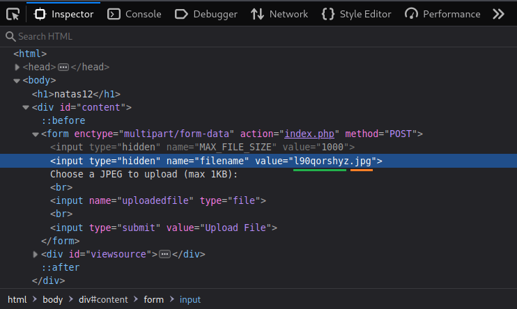

<br>

Faço a alteração para **.php**:

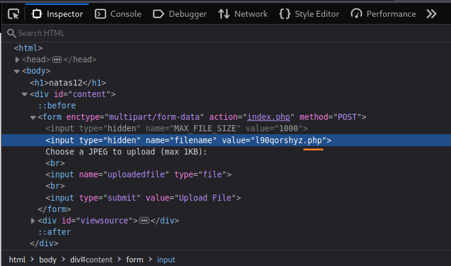

<br>

Por fim clico em **Upload File**:
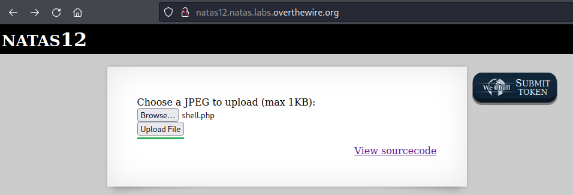

<br>

O arquivo foi enviado, mas sua extensão continua **.php**, excelente!.

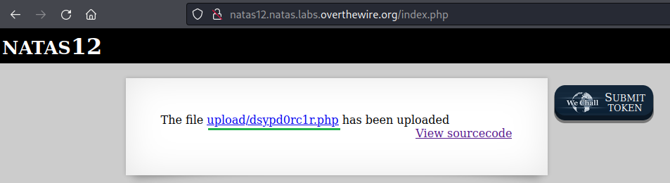

<br>


Clicando nesse arquivo recém criado recebo um erro indicando que o parâmetro **e** está indefinido, é o esperado já que não passei nenhum valor para esse parâmetro que será recuperado da URL pelo **$_GET['e']**:

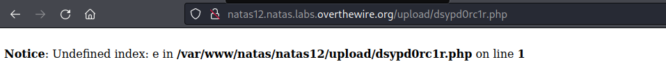

<br>

Adicionando **?e=ls** no fim da **URL** estou passando para o parâmetro **e** o valor **ls**, que em ambientes linux serve para listar o conteúdo de um diretório:
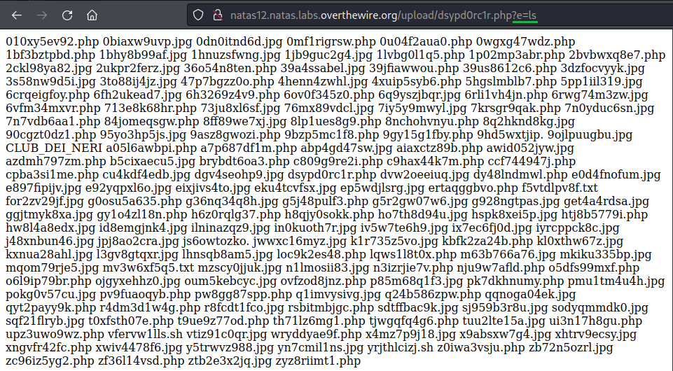


Obtenho diversos arquivos que estão nesse diretório **/upload**, porém antes de tentar procurar algo aqui vou fazer o simples e tentar acessar diretamente o password do próximo level que fica armazenado em **/etc/natas_webpass/natas13**:

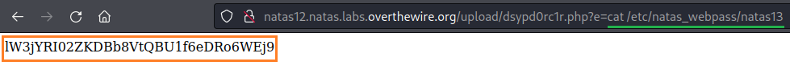

<br>

Funcionou! e dessa forma obtenho o password para o próximo level **natas13**:

    lW3jYRI02ZKDBb8VtQBU1f6eDRo6WEj9