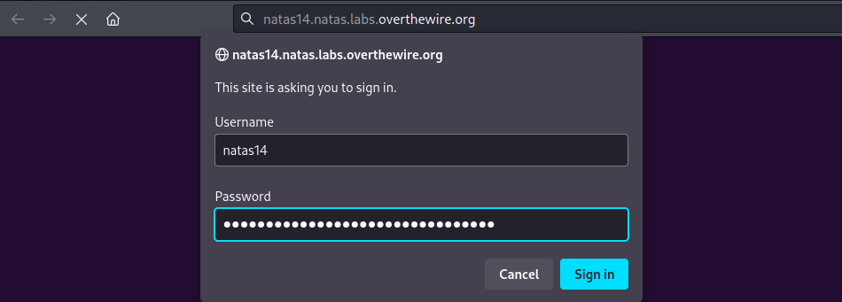
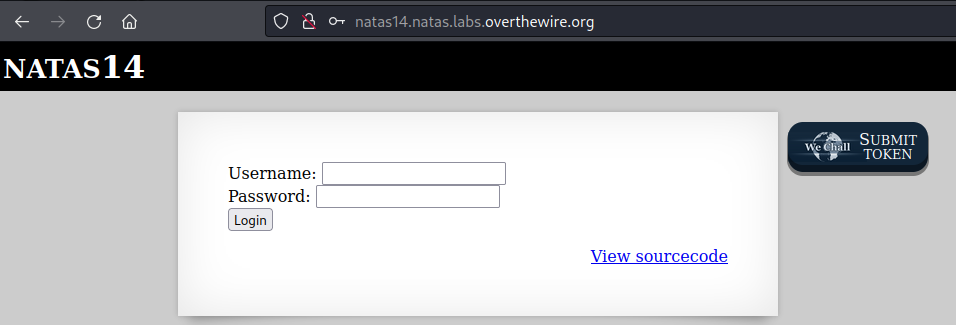
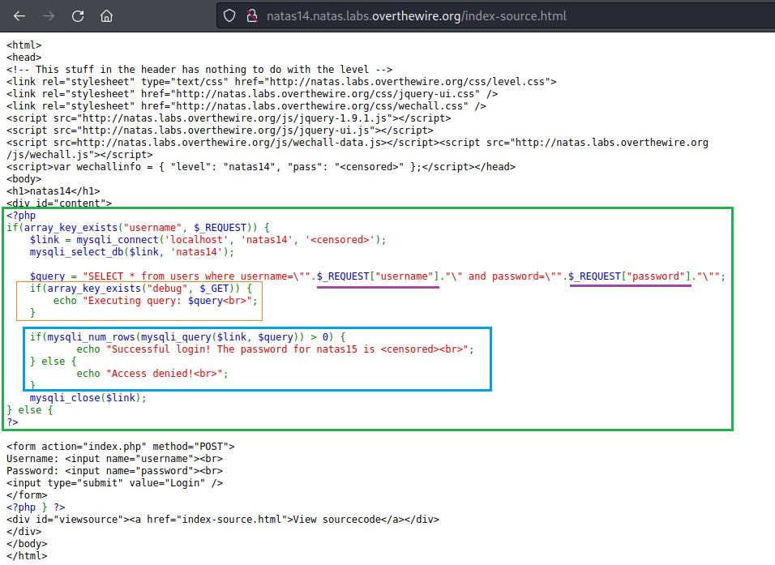
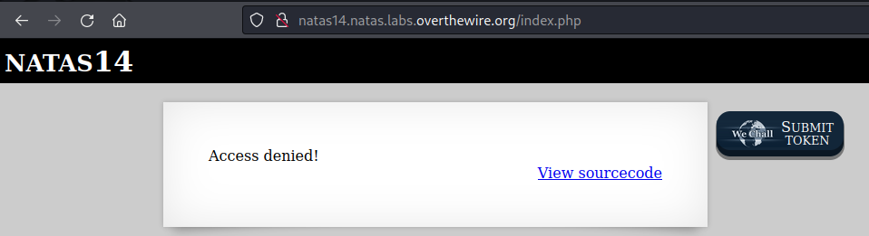
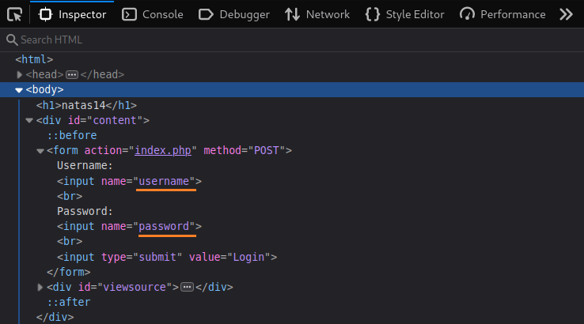
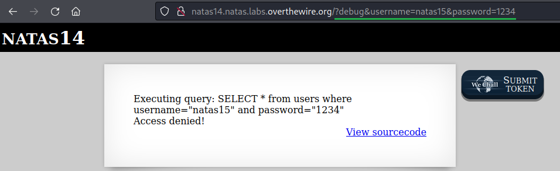
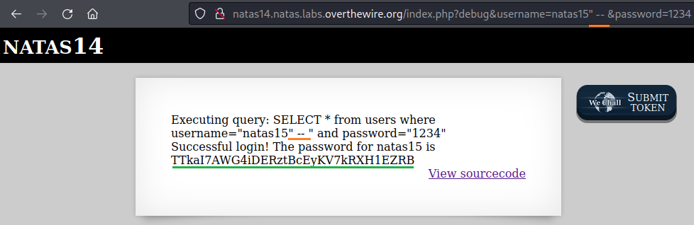

# [Natas Level 13-14](https://overthewire.org/wargames/natas/natas14.html)


### Objetivo
O objetivo desse level é encontrar o password para o próximo level **natas15**. Sem maiores informações além dos campos de username e password.


### Credenciais para autenticação no desafio

```
Username: natas14
```
```
Password: qPazSJBmrmU7UQJv17MHk1PGC4DxZMEP
```
```
URL: http://natas14.natas.labs.overthewire.org
```

### Resolução

Começo esse desafio abrindo a URL informada nas instruções e me autenticando no usuário **natas14**:



<br>

Após realizada a autenticação, dois campos aparecem um para colocar um usuário(**Username**) e outro para colocar a senha(**Password**):



<br>

Como não tenho nenhuma outra informação vou visualizar o código fonte acessando o link **View sourcode**:



<br>

O código acima de forma geral representa o seguinte:

    Se a solicitação incluir "username"(nesse caso o campo em que eu coloco o usuário), conecte-se ao banco de dados MySQL e realize uma consulta SELECT na base de dados "users" com a entrada do usuário.

    Além disso, se a solicitação incluir "debug", mostre qual consulta está sendo executada.

    Se a consulta retornar 1 ou mais linhas, exiba a senha.

    Caso contrário, exiba "acesso negado".

Alguns detalhes importantes nesse código:

    Em roxo a mostra que as entradas do usuário tanto username quanto password estão sendo colocadas diretamentamente na consulta sql, sem nenhum tratamento, o que pode permitir a exploração da vulnerabilidade SQL Injection.

    Em laranja caso eu inclua o parâmetro debug na URL, posso visualizar como a query está sendo executada, bem legal para facilitar a manipulação dessa query.

    Em azul caso a consulta retorne 1 ou mais linhas o password é mostrado, caso contrário uma mensagem de acesso negado é retornada.

    É um banco de dados mysql.

Faço uma tentativa de login com o usuário **natas15** já que o objetivo é descobrir o password desse level:


<br>

Tenho como resposta acesso negado(Access denied!):



<br>

Já que não sei exatamente como a query está sendo executada, vou habilitar o parâmetro **debug** visto no código anteriormente para me auxiliar. Os parâmetros de **username** e **password** também serão passados na URL.

Utilizando o **DevTools**(ferramentas de desenvolvedor) pelo atalho **F12** e acessando a aba **Inspector** vejo que os dois parâmetros chamam username e password:



<br>

Altero a URL, adicionando no final o seguinte:

    ?debug&username=natas15&password=1234

    // & serve para separar os parâmetros.


Dessa vez ao clicar em login além do acesso negado recebo a forma como a query está sendo executada, mostrando que o valor escrito nesses parâmetros está sendo colocado diretamente na query(consulta):



<br>

Já que eu não sei a senha do usuário **natas15**, procurei uma forma de burlar isso me aproveitando do fato de que o valores não estão sendo tratados e encontrei uma variação de SQL Injection:

    ?debug&username=natas15" -- &password=1234

    // a parte mais relevante é: " -- 

    A query final ficaria da seguinte forma:
    SELECT * from users where username = "natas15" -- and password=1234

    O que isso está fazendo é fechar a aspas duplas com " na entrada natas15 e ignorar todo o resto da consulta com -- que em mysql representa um comentário. 
    
    A query final Ficaria assim:
    SELECT * from users where username = "natas15"

    Caso exista um usuário natas15 no banco de dados, essa consulta vai funcionar me retornando pelo menos uma linha.

O código anterior funciona e recebo um password:



<br>

Dessa forma obtenho o password para o próximo level **natas15**:

    TTkaI7AWG4iDERztBcEyKV7kRXH1EZRB